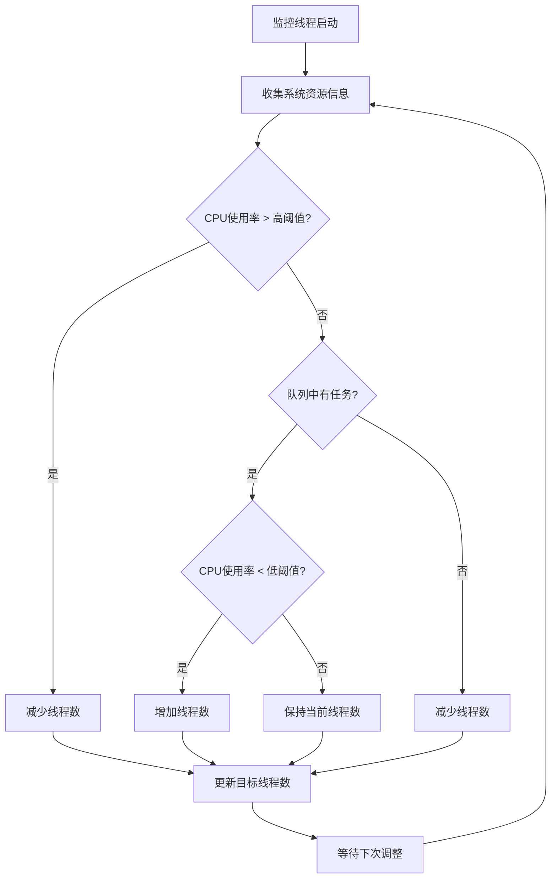
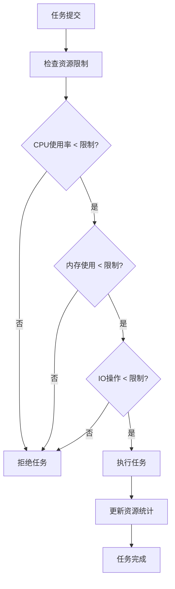

# SealDB

[](https://github.com/sealdb/seal/actions?query=workflow%3A%22Seal+Build%22+event%3Apush)
[](https://github.com/sealdb/seal/actions?query=workflow%3A%22Seal+Test%22+event%3Apush)
[](https://github.com/sealdb/seal/actions?query=workflow%3A%22Seal+Coverage%22)
[](https://codecov.io/gh/sealdb/seal)

SealDB 是一个基于 TiKV 的分布式数据库系统，使用 C/C++ 实现，提供高性能的 SQL 查询和事务处理能力。

## 特性

- 🚀 **高性能**: 基于 TiKV 的分布式存储引擎
- 🔄 **ACID 事务**: 支持完整的 ACID 事务语义
- 📊 **SQL 兼容**: 支持标准 SQL 语法
- 🔧 **可扩展**: 模块化设计，易于扩展
- 🛡️ **高可用**: 基于 TiKV 的分布式架构
- 🎯 **智能线程池**: 多级队列、自适应调度、资源限制

## 系统要求

- **操作系统**: Linux (推荐 Ubuntu 20.04+)
- **编译器**: GCC 7.0+ 或 Clang 6.0+
- **CMake**: 3.16+
- **依赖库**:
  - TiKV 客户端库
  - Protobuf 3.x
  - gRPC 1.x
  - OpenSSL
  - ZLIB

## 安装依赖

### Ubuntu/Debian

```bash
# 安装基础依赖
sudo apt update
sudo apt install -y build-essential cmake pkg-config libssl-dev zlib1g-dev

# 安装 TiKV 客户端库
# 注意：需要从源码编译或使用包管理器安装
```

### CentOS/RHEL

```bash
# 安装基础依赖
sudo yum groupinstall -y "Development Tools"
sudo yum install -y cmake3 pkgconfig openssl-devel zlib-devel

# 安装 TiKV 客户端库
```

## 编译

### 快速开始

```bash
# 克隆项目
git clone https://github.com/sealdb/seal.git
cd seal

# 编译项目
make build

# 或者使用 CMake 直接编译
mkdir build && cd build
cmake ..
make -j$(nproc)
```

### 编译选项

```bash
# 调试模式编译
make debug

# 发布模式编译
make release

# 清理编译文件
make clean

# 运行测试
make test
```

### 安装

```bash
# 安装到系统
make install

# 卸载
make uninstall
```

## 运行

### 启动 SealDB

```bash
# 使用默认配置启动
./build/bin/sealdb

# 使用自定义配置文件启动
./build/bin/sealdb config/sealdb.conf
```

### 配置文件

SealDB 使用简单的键值对配置文件格式：

```ini
# 服务器配置
server.host=0.0.0.0
server.port=3306
server.max_connections=1000

# TiKV 配置
tikv.pd_endpoints=127.0.0.1:2379
tikv.connection_pool_size=10
tikv.request_timeout=3000

# 线程池配置
thread_pool.min_threads=4
thread_pool.max_threads=32
thread_pool.enable_adaptive_scheduling=true
thread_pool.enable_resource_limits=true
thread_pool.max_cpu_percent=80
thread_pool.max_memory_mb=1024

# 日志配置
log.level=INFO
log.file=logs/sealdb.log
```

## 核心组件

### 高级线程池

SealDB 实现了参考 PolarDB 和 TiDB 设计的高级线程池，具备以下特性：

#### 1. 多级队列架构

```
┌─────────────────┐
│   CRITICAL      │ ← 系统关键任务 (最高优先级)
│   Queue         │
└─────────────────┘
┌─────────────────┐
│   HIGH          │ ← 用户查询任务 (高优先级)
│   Queue         │
└─────────────────┘
┌─────────────────┐
│   NORMAL        │ ← 一般任务 (普通优先级)
│   Queue         │
└─────────────────┘
┌─────────────────┐
│   LOW           │ ← 后台任务 (低优先级)
│   Queue         │
└─────────────────┘
┌─────────────────┐
│   BACKGROUND    │ ← 维护任务 (最低优先级)
│   Queue         │
└─────────────────┘
```

#### 2. 自适应调度流程



#### 3. 资源限制机制



#### 4. 线程池特性

| 特性 | 说明 | 实现方式 |
|------|------|----------|
| **多级队列** | 5个优先级队列 | 独立队列 + 优先级调度 |
| **自适应调度** | 动态调整线程数 | 监控线程 + 资源阈值 |
| **资源限制** | CPU/内存/IO限制 | 原子计数器 + 阈值检查 |
| **任务超时** | 防止任务长时间占用 | 超时检查 + 清理机制 |
| **原子统计** | 线程安全的统计信息 | `std::atomic` 变量 |
| **优雅关闭** | 安全停止和资源清理 | 停止标志 + 等待机制 |

#### 5. 性能优化

- **优先级调度**: 确保高优先级任务优先执行
- **资源隔离**: 不同优先级任务使用独立队列
- **动态调整**: 根据负载自动调整线程数
- **超时保护**: 防止任务长时间占用资源
- **统计监控**: 实时监控线程池性能指标

### 连接管理

SealDB 提供完整的连接管理功能：

- **连接池**: 管理数据库连接的生命周期
- **状态跟踪**: 实时监控连接状态
- **统计信息**: 详细的连接使用统计
- **资源清理**: 自动清理无效连接

## 项目结构

```
sealdb/
├── CMakeLists.txt          # 主构建文件
├── Makefile                # 便捷构建脚本
├── README.md               # 项目说明
├── config/                 # 配置文件
│   └── sealdb.conf
├── include/                # 公共头文件
│   └── sealdb/
│       ├── sealdb.h        # 主接口
│       ├── error.h         # 错误处理
│       ├── config.h        # 配置管理
│       ├── logger.h        # 日志系统
│       ├── thread_pool.h   # 高级线程池
│       └── connection.h    # 连接管理
├── src/                    # 源代码
│   ├── CMakeLists.txt      # 源码构建配置
│   ├── main.cpp            # 程序入口
│   ├── common/             # 通用模块
│   │   ├── CMakeLists.txt
│   │   ├── error.cpp/h     # 错误处理
│   │   ├── config.cpp/h    # 配置管理
│   │   ├── logger.cpp/h    # 日志系统
│   │   ├── utils.cpp/h     # 工具函数
│   │   ├── buffer.cpp/h    # 缓冲区管理
│   │   ├── thread_pool.cpp/h  # 高级线程池实现
│   │   └── connection.cpp/h   # 连接管理实现
│   ├── core/               # 核心计算层
│   │   ├── CMakeLists.txt
│   │   ├── engine.cpp/h    # 存储引擎
│   │   ├── transaction_manager.cpp/h  # 事务管理
│   │   ├── lock_manager.cpp/h         # 锁管理
│   │   ├── buffer_pool.cpp/h          # 缓冲池
│   │   └── checkpoint.cpp/h           # 检查点
│   ├── kv/                 # TiKV 客户端
│   │   ├── CMakeLists.txt
│   │   ├── tikv_client.cpp/h          # TiKV 客户端
│   │   ├── tikv_connection.cpp/h      # 连接管理
│   │   ├── tikv_transaction.cpp/h     # 事务处理
│   │   └── tikv_storage.cpp/h         # 存储接口
│   ├── sql/                # SQL 处理
│   │   ├── CMakeLists.txt
│   │   ├── parser.cpp/h    # SQL 解析器
│   │   ├── lexer.cpp/h     # 词法分析器
│   │   ├── ast.cpp/h       # 抽象语法树
│   │   ├── executor.cpp/h  # SQL 执行器
│   │   └── statement.cpp/h # 语句处理
│   ├── planner/            # 查询优化
│   │   ├── CMakeLists.txt
│   │   ├── optimizer.cpp/h # 查询优化器
│   │   ├── planner.cpp/h   # 执行计划生成
│   │   ├── cost_estimator.cpp/h       # 成本估算
│   │   └── index_selector.cpp/h       # 索引选择
│   └── server/             # 服务层
│       ├── CMakeLists.txt
│       ├── mysql_server.cpp/h         # MySQL 协议服务
│       ├── http_server.cpp/h          # HTTP API 服务
│       ├── connection_manager.cpp/h   # 连接管理
│       └── session.cpp/h              # 会话管理
├── tests/                  # 测试代码
│   ├── CMakeLists.txt
│   ├── unit/               # 单元测试
│   └── integration/        # 集成测试
├── tools/                  # 工具程序
│   └── CMakeLists.txt
├── docs/                   # 文档目录
│   ├── architecture.md     # 架构设计文档
│   ├── thread_pool_design.md  # 线程池设计文档
│   └── development_guide.md   # 开发指南
├── examples/               # 示例代码
│   ├── CMakeLists.txt
│   └── thread_pool_test.cpp # 线程池测试示例
└── build/                  # 构建输出目录
```

## 文档

详细的文档请参考 `docs/` 目录：

- **[快速开始指南](docs/quick_start.md)**: 快速搭建开发环境并运行第一个示例
- **[架构设计文档](docs/architecture.md)**: 系统架构、核心组件、数据流等详细说明
- **[线程池设计文档](docs/thread_pool_design.md)**: 高级线程池的实现原理、性能优化等
- **[API 参考文档](docs/api_reference.md)**: 完整的 API 接口说明和使用示例
- **[开发指南](docs/development_guide.md)**: 开发环境搭建、代码规范、贡献流程等

## 开发指南

### 添加新模块

1. 在 `src/` 下创建新目录
2. 创建 `CMakeLists.txt` 文件
3. 在 `src/CMakeLists.txt` 中添加子目录
4. 实现相应的 `.cpp` 和 `.h` 文件

### 运行测试

```bash
# 运行所有测试
make test

# 运行线程池测试
./build/examples/thread_pool_test

# 运行特定测试
cd build && ctest -R test_name
```

### 代码风格

- 使用 C++17 标准
- 遵循 Google C++ 风格指南
- 使用 `clang-format` 格式化代码
- 添加适当的注释和文档
- 优先使用 C 风格实现（如原子操作）

## 贡献

欢迎贡献代码！请遵循以下步骤：

1. Fork 项目
2. 创建功能分支 (`git checkout -b feature/AmazingFeature`)
3. 提交更改 (`git commit -m 'Add some AmazingFeature'`)
4. 推送到分支 (`git push origin feature/AmazingFeature`)
5. 创建 Pull Request

## 许可证

本项目采用 Apache 2.0 许可证 - 查看 [LICENSE](LICENSE) 文件了解详情。

## 联系方式

- 项目主页: https://github.com/sealdb/seal
- 问题反馈: https://github.com/sealdb/seal/issues
- 讨论区: https://github.com/sealdb/seal/discussions