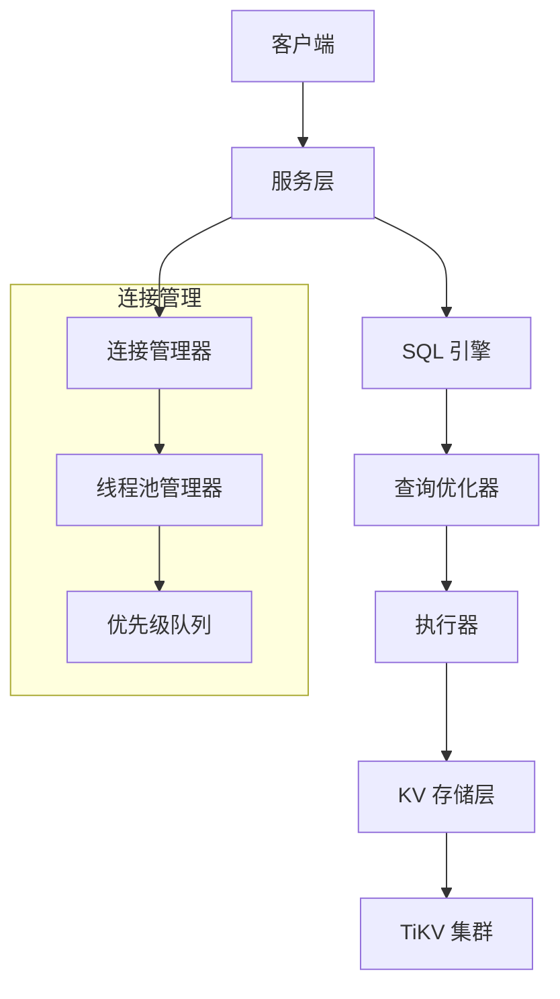

<h1 align="center">SealDB: The Next-Gen Cloud-Native Distributed AI Database</h1>
<h2 align="center">SQL for All Data: structured, semi-structured & unstructured multimodal data</h2>

<div align="center">

<h4 align="center">
  <a href="https://docs.sealdb.com/guides/cloud">SealDB Serverless Cloud</a>  |
  <a href="https://docs.sealdb.com/">Documentation</a>  |
  <a href="https://github.com/sealdb/sealdb/issues/1">Roadmap (v0.1)</a>
</h4>

</div>

# SealDB 🦭

[](https://www.rust-lang.org/)
[](LICENSE)
[]()

SealDB 是一个基于 Rust 开发的高性能分布式数据库系统，采用 TiKV 作为底层存储引擎，提供完整的 SQL 查询能力和企业级特性。

## ✨ 核心特性

- **🚀 高性能**: 基于 Rust 和 Tokio 异步运行时，支持高并发处理
- **🔧 完整 SQL 支持**: 支持 SELECT、INSERT、UPDATE、DELETE、CREATE TABLE 等标准 SQL 语句
- **🧠 智能优化**: 完整的 PostgreSQL 风格 RBO 优化器，包含 12 种核心优化规则
- **🔗 连接管理**: 多级优先级队列和智能连接池管理
- **📊 实时监控**: CPU、内存、网络等系统资源实时监控
- **🔄 分布式存储**: 基于 TiKV 的分布式存储引擎
- **⚡ 异步架构**: 全异步设计，支持高并发和低延迟

## 🏗️ 系统架构



## 🚀 快速开始

### 系统要求

- **操作系统**: Linux (推荐 Ubuntu 20.04+)
- **内存**: 最少 4GB，推荐 8GB+
- **Rust**: 1.70+ (通过 rustup 安装)

### 安装和运行

#### 方法一：使用 Makefile（推荐）

```bash
# 1. 安装 Rust
curl --proto '=https' --tlsv1.2 -sSf https://sh.rustup.rs | sh
source ~/.cargo/env

# 2. 安装系统依赖
sudo apt update && sudo apt install -y pkg-config libssl-dev

# 3. 克隆项目
git clone https://github.com/sealdb/sealdb.git
cd sealdb

# 4. 使用 Makefile 命令
make build          # 构建项目
make test           # 运行测试
make dev            # 开发模式运行
make lint           # 代码检查
make format         # 格式化代码
```

#### 方法二：使用 Docker

```bash
# 构建 Docker 镜像
make docker-build

# 启动完整环境（包含 TiKV 集群和监控）
make docker-run

# 查看日志
docker-compose logs -f sealdb

# 停止环境
make docker-stop
```

#### 方法三：直接使用 Cargo

```bash
# 1. 安装 Rust
curl --proto '=https' --tlsv1.2 -sSf https://sh.rustup.rs | sh
source ~/.cargo/env

# 2. 安装系统依赖
sudo apt update && sudo apt install -y pkg-config libssl-dev

# 3. 克隆项目
git clone https://github.com/sealdb/sealdb.git
cd sealdb

# 4. 编译和运行
cargo build
cargo test
cargo run --bin sealdb
```

### 使用示例

```sql
-- 创建数据库和表
CREATE DATABASE testdb;
USE testdb;

CREATE TABLE users (
    id INT PRIMARY KEY,
    name VARCHAR(255) NOT NULL,
    email VARCHAR(255) UNIQUE,
    created_at TIMESTAMP DEFAULT CURRENT_TIMESTAMP
);

-- 插入数据
INSERT INTO users (id, name, email) VALUES
(1, 'Alice', 'alice@example.com'),
(2, 'Bob', 'bob@example.com');

-- 查询数据
SELECT * FROM users WHERE id > 1;
```

## 📚 文档

- **[快速开始指南](docs/quickstart.md)** - 安装、配置和使用教程
- **[架构设计](docs/architecture.md)** - 系统架构和模块设计
- **[SQL 引擎设计](docs/sql-engine.md)** - SQL 解析、优化和执行
- **[RBO 优化器设计](docs/rbo-optimization.md)** - 完整的 PostgreSQL 风格规则基础优化
- **[连接管理设计](docs/connection-management.md)** - 连接池和线程池管理
- **[CI/CD 设置指南](docs/ci-cd-setup.md)** - 持续集成和部署配置

## 🛠️ 技术栈

| 组件 | 技术 | 说明 |
|------|------|------|
| **语言** | Rust | 高性能系统编程语言 |
| **异步运行时** | Tokio | 高性能异步 I/O |
| **存储引擎** | TiKV | 分布式 KV 存储 |
| **SQL 解析** | sqlparser-rs | SQL 语法解析 |
| **查询优化** | 自研 RBO | PostgreSQL 风格规则基础优化 |
| **序列化** | Serde | 数据序列化 |
| **错误处理** | thiserror + anyhow | 统一错误处理 |
| **日志** | tracing | 分布式追踪 |
| **监控** | sysinfo | 系统资源监控 |
| **CI/CD** | GitHub Actions | 自动化构建和部署 |
| **容器化** | Docker | 应用容器化 |
| **监控栈** | Prometheus + Grafana | 系统监控和可视化 |

## 🔧 项目结构

```
sealdb/
├── src/                    # 内核模块
│   ├── common/             # 公共模块 (配置、错误、类型、连接管理)
│   ├── core/               # 核心计算逻辑
│   ├── kv/                 # KV 存储层 (TiKV 客户端)
│   ├── sql/                # SQL 引擎 (解析器、优化器、执行器)
│   ├── planner/            # 查询计划器
│   └── server/             # 服务层
├── tests/                  # 测试目录
│   ├── integration/        # 集成测试
│   └── regression/         # 回归测试
│       └── test_framework/ # 测试框架
├── bin/                    # 可执行文件
├── docs/                   # 文档
├── .github/workflows/      # GitHub Actions 工作流
├── monitoring/             # 监控配置 (Prometheus, Grafana)
├── Dockerfile              # Docker 镜像构建
├── docker-compose.yml      # Docker 编排配置
├── Makefile                # 开发工具脚本
├── config.toml             # 配置文件
└── README.md              # 项目说明
```

## 🎯 核心功能

### SQL 引擎
- **解析器**: 支持标准 SQL 语法，生成抽象语法树 (AST)
- **优化器**: 完整的 PostgreSQL 风格 RBO 优化器，包含 12 种核心优化规则
- **执行器**: 高效执行优化后的查询计划

### 连接管理
- **连接池**: 智能连接复用和管理
- **优先级队列**: 多级请求优先级调度
- **资源监控**: 实时 CPU、内存使用监控

### 存储引擎
- **TiKV 集成**: 分布式 KV 存储支持
- **事务支持**: ACID 事务特性
- **高可用**: 分布式架构保证高可用性

## 📊 性能特性

- **高并发**: 支持数千并发连接
- **低延迟**: 毫秒级查询响应
- **高吞吐**: 每秒数万次查询处理
- **智能调度**: 基于优先级的请求调度
- **资源优化**: 动态资源分配和监控

## 🤝 贡献指南

我们欢迎所有形式的贡献！

1. **Fork** 本仓库
2. 创建特性分支 (`git checkout -b feature/amazing-feature`)
3. 提交更改 (`git commit -m 'Add amazing feature'`)
4. 推送到分支 (`git push origin feature/amazing-feature`)
5. 创建 **Pull Request**

### 开发环境设置

```bash
# 克隆项目
git clone https://github.com/sealdb/sealdb.git
cd sealdb

# 安装开发依赖
make install-deps

# 构建项目
make build

# 运行测试
make test

# 代码检查
make lint

# 格式化代码
make format

# 生成覆盖率报告
make coverage
```

### CI/CD 流水线

项目配置了完整的 CI/CD 流水线：

- **自动化测试**: 多版本 Rust 测试，代码质量检查
- **代码覆盖率**: 自动生成覆盖率报告并上传到 Codecov
- **安全审计**: 依赖安全检查，漏洞扫描
- **Docker 构建**: 自动构建和推送 Docker 镜像
- **多平台发布**: 支持 Linux、Windows、macOS 平台

详细配置请参考 [CI/CD 设置指南](docs/ci-cd-setup.md)。

## 📄 许可证

本项目采用 [Apache 2.0 许可证](LICENSE)。

## 🙏 致谢

- [TiKV](https://github.com/tikv/tikv) - 分布式 KV 存储引擎
- [sqlparser-rs](https://github.com/sqlparser-rs/sqlparser-rs) - SQL 解析库
- [Tokio](https://github.com/tokio-rs/tokio) - 异步运行时
- [Rust](https://www.rust-lang.org/) - 系统编程语言

## 📞 联系我们

- **GitHub Issues**: [提交问题](https://github.com/sealdb/sealdb/issues)
- **GitHub Discussions**: [社区讨论](https://github.com/sealdb/sealdb/discussions)
- **邮箱**: wenshuang_lu@163.com

---

⭐ 如果这个项目对你有帮助，请给我们一个 Star！