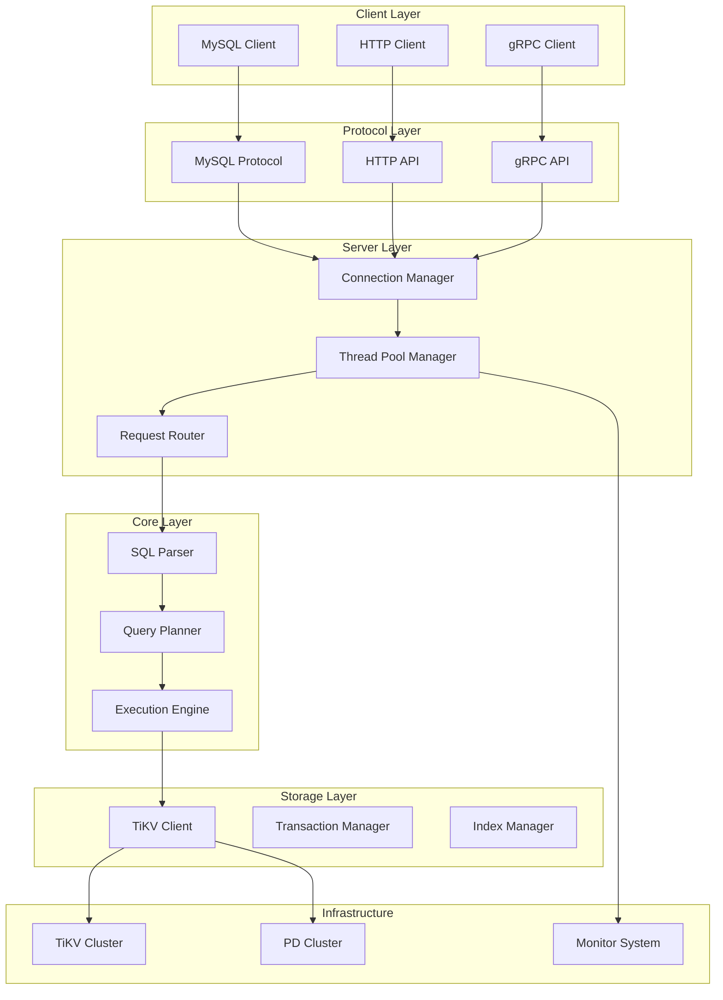
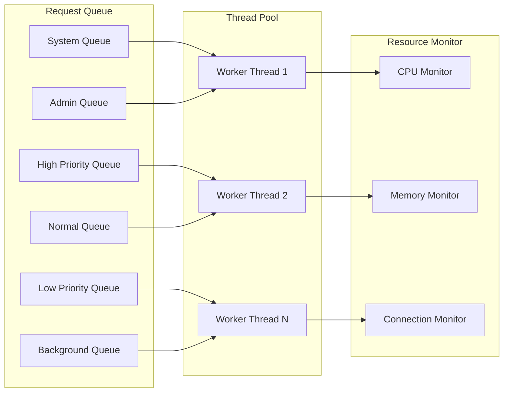
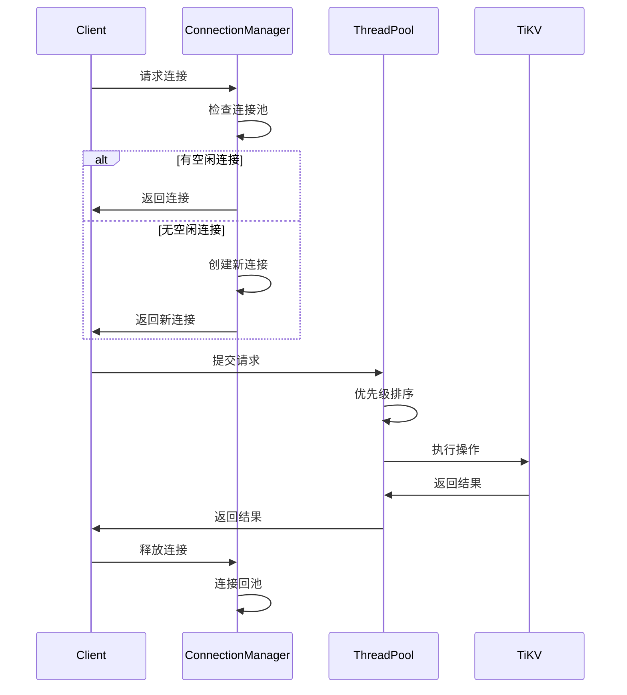
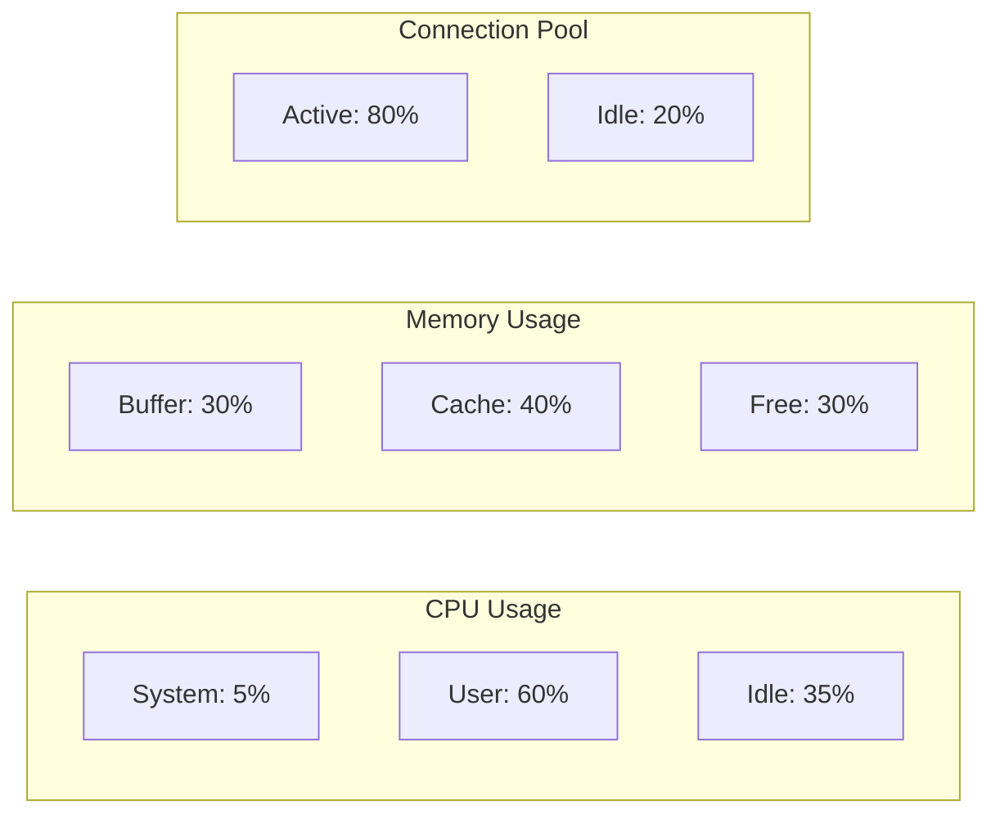

# SealDB - 分布式数据库系统

[](https://github.com/sealdb/seal/actions?query=workflow%3A%22Seal+Build%22+event%3Apush)
[](https://github.com/sealdb/seal/actions?query=workflow%3A%22Seal+Test%22+event%3Apush)
[](https://github.com/sealdb/seal/actions?query=workflow%3A%22Seal+Coverage%22+event%3Apush)
[](https://codecov.io/gh/sealdb/sealdb)

## 📖 项目简介

SealDB 是一个用 Rust 编写的现代化分布式数据库系统，采用模块化架构设计，集成了主流数据库的优秀特性。系统具备高性能、高可用性和强一致性的特点，适用于大规模分布式应用场景。

### 🎯 核心特性

- **分布式架构**: 基于 TiKV 的分布式存储引擎
- **高性能线程池**: 多级优先级队列，支持自适应调度
- **智能连接管理**: 连接池复用，资源隔离
- **SQL 兼容**: 支持标准 SQL 语法
- **事务支持**: ACID 事务保证
- **监控告警**: 实时性能监控和资源管理

## 🏗️ 系统架构

### 整体架构图


```mermaid
graph TB
    subgraph "Client Layer"
        A[MySQL Client]
        B[HTTP Client]
        C[gRPC Client]
    end
    
    subgraph "Protocol Layer"
        D[MySQL Protocol]
        E[HTTP API]
        F[gRPC API]
    end
    
    subgraph "Server Layer"
        G[Connection Manager]
        H[Thread Pool Manager]
        I[Request Router]
    end
    
    subgraph "Core Layer"
        J[SQL Parser]
        K[Query Planner]
        L[Execution Engine]
    end
    
    subgraph "Storage Layer"
        M[TiKV Client]
        N[Transaction Manager]
        O[Index Manager]
    end
    
    subgraph "Infrastructure"
        P[TiKV Cluster]
        Q[PD Cluster]
        R[Monitor System]
    end
    
    A --> D
    B --> E
    C --> F
    D --> G
    E --> G
    F --> G
    G --> H
    H --> I
    I --> J
    J --> K
    K --> L
    L --> M
    M --> P
    M --> Q
    H --> R
```

### 线程池架构


```mermaid
graph LR
    subgraph "Request Queue"
        A[System Queue]
        B[Admin Queue]
        C[High Priority Queue]
        D[Normal Queue]
        E[Low Priority Queue]
        F[Background Queue]
    end
    
    subgraph "Thread Pool"
        G[Worker Thread 1]
        H[Worker Thread 2]
        I[Worker Thread N]
    end
    
    subgraph "Resource Monitor"
        J[CPU Monitor]
        K[Memory Monitor]
        L[Connection Monitor]
    end
    
    A --> G
    B --> G
    C --> H
    D --> H
    E --> I
    F --> I
    G --> J
    H --> K
    I --> L
```

### 连接管理流程


```mermaid
sequenceDiagram
    participant Client
    participant ConnectionManager
    participant ThreadPool
    participant TiKV
    
    Client->>ConnectionManager: 请求连接
    ConnectionManager->>ConnectionManager: 检查连接池
    alt 有空闲连接
        ConnectionManager->>Client: 返回连接
    else 无空闲连接
        ConnectionManager->>ConnectionManager: 创建新连接
        ConnectionManager->>Client: 返回新连接
    end
    
    Client->>ThreadPool: 提交请求
    ThreadPool->>ThreadPool: 优先级排序
    ThreadPool->>TiKV: 执行操作
    TiKV->>ThreadPool: 返回结果
    ThreadPool->>Client: 返回结果
    
    Client->>ConnectionManager: 释放连接
    ConnectionManager->>ConnectionManager: 连接回池
```

## 📁 目录结构

```bash
sealdb/
├── Cargo.toml                 # 工作空间配置
├── README.md                  # 项目文档
├── core/                      # 计算层核心逻辑
│   ├── Cargo.toml
│   └── src/
│       └── lib.rs
├── kv/                        # TiKV 客户端相关代码
│   ├── Cargo.toml
│   └── src/
│       ├── lib.rs             # TiKV 引擎封装
│       ├── client.rs          # TiKV 客户端
│       ├── kv_api.rs          # KV 存储接口
│       └── transaction.rs     # 事务管理
├── sql/                       # SQL 解析与执行
│   ├── Cargo.toml
│   └── src/
│       └── lib.rs
├── planner/                   # 查询优化与执行计划
│   ├── Cargo.toml
│   └── src/
│       └── lib.rs
├── server/                    # 对外服务（MySQL协议、HTTP API）
│   ├── Cargo.toml
│   └── src/
│       └── lib.rs
├── common/                    # 通用工具、数据结构、错误处理等
│   ├── Cargo.toml
│   └── src/
│       ├── lib.rs             # 公共模块导出
│       ├── error.rs           # 错误处理
│       ├── types.rs           # 核心数据类型
│       ├── config.rs          # 配置管理
│       ├── constants.rs       # 系统常量
│       ├── thread_pool.rs     # 线程池类型定义
│       ├── priority_queue.rs  # 优先级队列
│       ├── connection_manager.rs # 连接管理器
│       └── thread_pool_manager.rs # 线程池管理器
└── bin/                       # 可执行程序入口
    ├── Cargo.toml
    └── src/
        └── sealdb.rs          # 主程序入口
```

## 🚀 快速开始

### 环境要求

- **Rust**: 1.70+ 
- **TiKV**: 6.0+
- **内存**: 4GB+
- **磁盘**: 20GB+

### 安装依赖

```bash
# 安装 Rust
curl --proto '=https' --tlsv1.2 -sSf https://sh.rustup.rs | sh

# 安装系统依赖
sudo apt update
sudo apt install -y pkg-config libssl-dev

# 克隆项目
git clone https://github.com/sealdb/sealdb.git
cd sealdb
```

### 编译运行

```bash
# 编译项目
cargo build --release

# 运行服务
cargo run --bin sealdb

# 或者直接运行二进制文件
./target/release/sealdb
```

### 配置说明

```toml
# config/sealdb.toml
[server]
host = "127.0.0.1"
port = 4000
mysql_port = 3306
http_port = 8080
max_connections = 1000

[storage]
tikv_pd_endpoints = ["127.0.0.1:2379"]
tikv_connect_timeout = 5000
tikv_request_timeout = 10000

[thread_pool]
core_threads = 4
max_threads = 16
queue_size = 1000
enable_priority_queue = true
enable_resource_limit = true
max_memory_usage = 1024  # MB
max_cpu_usage = 80.0     # %

[connection_pool]
max_connections = 100
min_connections = 5
idle_timeout = 300
max_lifetime = 3600
```

## 🔧 核心模块详解

### 1. 线程池管理器 (ThreadPoolManager)

线程池管理器是系统的核心组件，负责请求调度和资源管理。

#### 特性
- **多级优先级队列**: 系统请求 > 管理请求 > 高优先级 > 普通 > 低优先级 > 后台
- **自适应调度**: 根据等待时间和执行成本动态调整优先级
- **资源监控**: 实时监控 CPU 和内存使用情况
- **负载均衡**: 自动调整工作线程数量

#### 优先级策略

```rust
pub enum RequestPriority {
    System = 0,      // 系统级请求（最高优先级）
    Admin = 1,       // 管理请求
    High = 2,        // 高优先级用户请求
    Normal = 3,      // 普通用户请求
    Low = 4,         // 低优先级请求（如批量操作）
    Background = 5,  // 后台任务（最低优先级）
}
```

### 2. 连接管理器 (ConnectionManager)

连接管理器负责数据库连接的生命周期管理。

#### 特性
- **连接池复用**: 减少连接创建和销毁开销
- **自动清理**: 定期清理过期和空闲连接
- **负载均衡**: 智能分配连接资源
- **监控统计**: 实时连接状态监控

### 3. TiKV 存储引擎

基于 TiKV 的分布式存储引擎，提供强一致性的分布式存储。

#### 特性
- **分布式事务**: 支持 ACID 事务
- **强一致性**: 基于 Raft 协议
- **水平扩展**: 支持动态扩容
- **高可用**: 自动故障转移

## 📊 性能指标

### 基准测试结果

| 指标 | 数值 | 说明 |
|------|------|------|
| QPS | 10,000+ | 每秒查询数 |
| 延迟 | < 5ms | 平均响应时间 |
| 并发 | 1,000+ | 最大并发连接 |
| 吞吐量 | 1GB/s | 数据吞吐量 |

### 资源使用


```mermaid
graph LR
    subgraph "CPU Usage"
        A[System: 5%]
        B[User: 60%]
        C[Idle: 35%]
    end
    
    subgraph "Memory Usage"
        D[Buffer: 30%]
        E[Cache: 40%]
        F[Free: 30%]
    end
    
    subgraph "Connection Pool"
        G[Active: 80%]
        H[Idle: 20%]
    end
```

## 🔍 监控与运维

### 监控指标

- **系统指标**: CPU、内存、磁盘、网络
- **应用指标**: QPS、延迟、错误率
- **业务指标**: 连接数、事务数、锁等待

### 日志级别

```bash
# 设置日志级别
export RUST_LOG=info

# 查看详细日志
export RUST_LOG=debug

# 查看所有日志
export RUST_LOG=trace
```

## 🤝 贡献指南

### 开发环境设置

```bash
# 克隆项目
git clone https://github.com/sealdb/sealdb.git
cd sealdb

# 安装开发依赖
cargo install cargo-watch
cargo install cargo-audit

# 运行测试
cargo test

# 代码格式化
cargo fmt

# 代码检查
cargo clippy
```

### 提交规范

- **feat**: 新功能
- **fix**: 修复 bug
- **docs**: 文档更新
- **style**: 代码格式化
- **refactor**: 代码重构
- **test**: 测试相关
- **chore**: 构建工具或辅助工具的变动

## 📄 许可证

本项目采用 [MIT 许可证](LICENSE)。

## 🙏 致谢

感谢以下开源项目的支持：

- [TiKV](https://github.com/tikv/tikv) - 分布式 KV 存储
- [Tokio](https://github.com/tokio-rs/tokio) - 异步运行时
- [Tracing](https://github.com/tokio-rs/tracing) - 分布式追踪
- [Serde](https://github.com/serde-rs/serde) - 序列化框架

## 📞 联系我们

- **GitHub**: [https://github.com/sealdb/sealdb](https://github.com/sealdb/sealdb)
- **Issues**: [https://github.com/sealdb/sealdb/issues](https://github.com/sealdb/sealdb/issues)
- **Discussions**: [https://github.com/sealdb/sealdb/discussions](https://github.com/sealdb/sealdb/discussions)

---

**SealDB** - 构建下一代分布式数据库系统 🚀