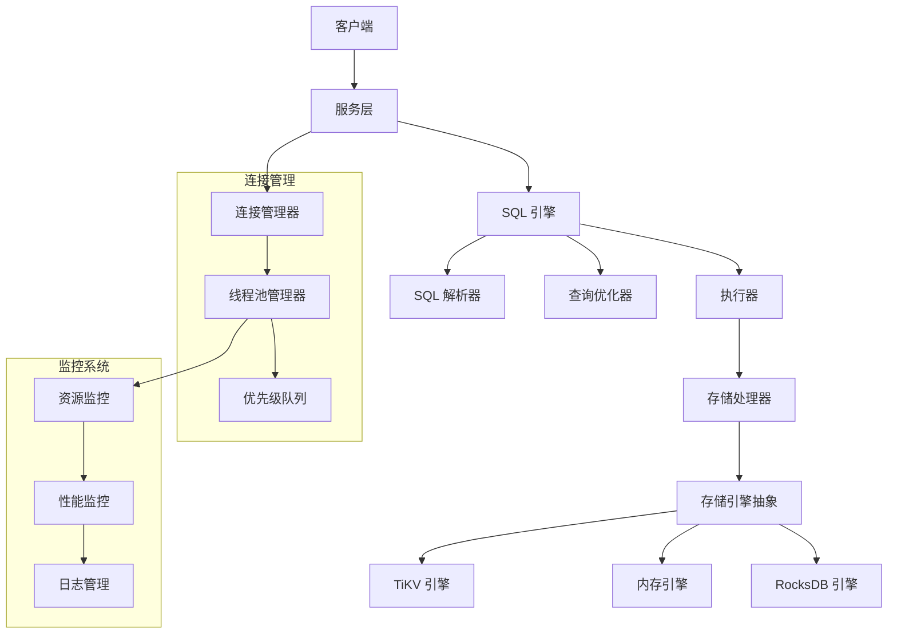
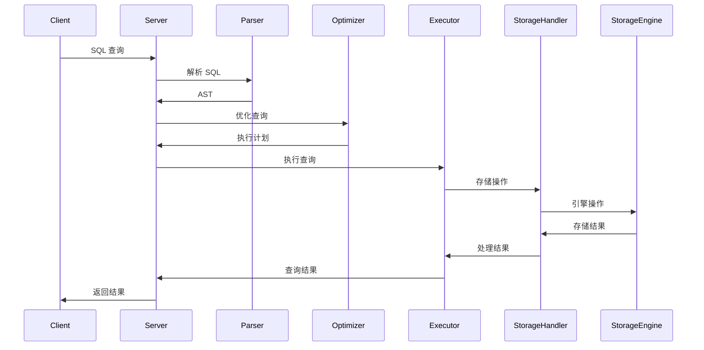
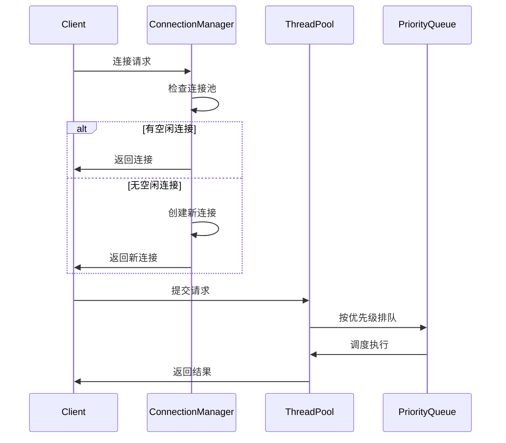
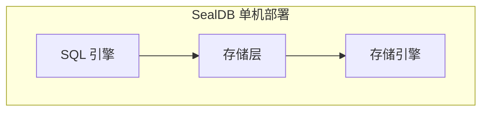
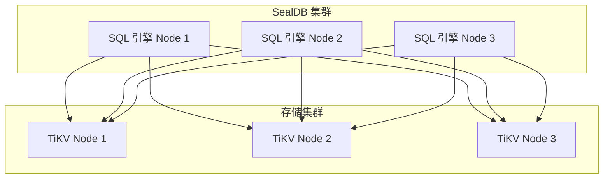

# SealDB 架构设计

## 系统概述

SealDB 是一个基于 Rust 开发的高性能分布式数据库系统，采用分层架构设计，支持多种存储引擎。系统提供完整的 SQL 查询能力和企业级特性，支持高并发、高可用的数据存储和查询服务。

## 核心架构



## 架构层次

### 1. 应用层 (Application Layer)
- 提供 SQL 接口和 MySQL 协议支持
- 处理客户端连接和认证
- 管理会话和事务
- 提供 HTTP API 接口

### 2. SQL 引擎层 (SQL Engine Layer)

#### 2.1 SQL 解析器 (Parser)
- 使用 `sqlparser-rs` 进行 SQL 语句解析
- 支持 SELECT、INSERT、UPDATE、DELETE、CREATE TABLE 等标准 SQL 语句
- 生成抽象语法树 (AST)
- 语法验证和错误处理

```rust
// 解析 SQL 语句
let ast = parser.parse("SELECT * FROM users WHERE id = 1")?;
```

#### 2.2 查询优化器 (Optimizer)

**基于规则的优化 (RBO)**:
- 常量折叠 (Constant Folding)
- 谓词下推 (Predicate Pushdown)
- 列裁剪 (Column Pruning)
- 连接重排序 (Join Reorder)
- 索引选择 (Index Selection)
- 子查询优化 (Subquery Optimization)

**基于成本的优化 (CBO)**:
- 成本模型和统计信息
- 候选计划生成
- 最优计划选择
- 并行执行计划优化

```rust
// 优化查询计划
let optimized_plan = optimizer.optimize(ast)?;
```

#### 2.3 执行器 (Executor)
- 执行优化后的查询计划
- 支持表扫描、索引扫描等操作
- 结果集处理和返回
- 事务管理和并发控制

```rust
// 执行查询计划
let result = executor.execute(optimized_plan)?;
```

#### 2.4 存储处理器 (Storage Handler)
- 作为 SQL 引擎与存储层之间的桥梁
- 将 SQL 操作转换为存储操作
- 处理不同存储引擎的差异
- 提供统一的存储接口

```rust
// 将 SQL 操作转换为存储操作
let storage_handler = StorageHandler::new();
let result = storage_handler.scan_table("users", &columns, limit, engine_type).await?;
```

### 3. 存储层 (Storage Layer)

#### 3.1 存储引擎抽象
提供统一的存储接口，支持多种存储引擎：

```rust
#[async_trait]
pub trait StorageEngine: Send + Sync {
    async fn get(&self, key: &Key, context: &StorageContext, options: &StorageOptions) -> Result<StorageResult<Option<Value>>>;
    async fn put(&self, key: &Key, value: &Value, context: &StorageContext, options: &StorageOptions) -> Result<StorageResult<()>>;
    async fn delete(&self, key: &Key, context: &StorageContext, options: &StorageOptions) -> Result<StorageResult<()>>;
    async fn scan(&self, start_key: &Key, end_key: &Key, limit: u32, context: &StorageContext, options: &StorageOptions) -> Result<StorageResult<Vec<KeyValue>>>;
}
```

#### 3.2 存储引擎实现

**TiKV 引擎**
- 基于 TiKV 分布式存储
- 支持事务和 ACID 特性
- 高可用和水平扩展
- 支持复杂数据类型

```rust
pub struct TiKVEngine {
    raw_client: Option<RawClient>,
    transaction_client: Option<TransactionClient>,
    // ...
}
```

**内存引擎**
- 高性能内存存储
- 适用于临时数据和缓存
- 支持快速读写操作

```rust
pub struct MemoryEngine {
    data: Arc<RwLock<HashMap<Key, Value>>>,
    // ...
}
```

**RocksDB 引擎**
- 基于 RocksDB 的本地存储
- 支持持久化存储
- 高性能的键值存储

## 连接管理

### 连接管理器
- 连接池管理
- 连接生命周期控制
- 负载均衡和故障转移

### 线程池管理器
- 多级优先级队列
- 资源监控和限制
- 动态线程调整

### 请求优先级
```rust
pub enum RequestPriority {
    System,      // 系统级请求
    Admin,       // 管理请求
    High,        // 高优先级
    Normal,      // 普通请求
    Low,         // 低优先级
    Background,  // 后台任务
}
```

## 数据流

### 查询执行流程



### 存储操作流程

1. **SQL 操作**: 执行器接收 SQL 操作
2. **存储转换**: 存储处理器将 SQL 操作转换为存储操作
3. **引擎执行**: 存储引擎执行具体的存储操作
4. **结果转换**: 将存储结果转换为 SQL 结果

### 连接管理流程



## 扩展性设计

### 存储引擎扩展

添加新的存储引擎只需要实现 `StorageEngine` trait：

```rust
pub struct NewStorageEngine {
    // 实现细节
}

#[async_trait]
impl StorageEngine for NewStorageEngine {
    // 实现所有必需的方法
}
```

### 操作符扩展

添加新的操作符只需要实现 `Operator` trait：

```rust
pub struct NewOperator {
    // 实现细节
}

#[async_trait]
impl Operator for NewOperator {
    // 实现所有必需的方法
}
```

### 模块化架构
- 松耦合的模块设计
- 插件化的功能扩展
- 标准化的接口定义

### 水平扩展
- 无状态服务设计
- 分布式存储支持
- 负载均衡能力

### 功能扩展
- 可插拔的优化规则
- 可扩展的执行计划
- 自定义函数支持

## 配置管理

### 存储引擎配置

```toml
[storage]
default_engine = "TiKV"
engines = ["TiKV", "Memory", "RocksDB"]

[storage.tikv]
endpoints = ["127.0.0.1:2379"]
timeout_ms = 5000
max_connections = 100

[storage.memory]
max_size = "1GB"

[storage.rocksdb]
data_path = "/data/rocksdb"
max_open_files = 1000
```

### SQL 引擎配置

```toml
[sql]
max_connections = 1000
query_timeout_ms = 30000
enable_optimization = true

[sql.optimizer]
enable_cost_based_optimization = true
enable_rule_based_optimization = true
max_plans_per_group = 100
```

## 性能优化

### 存储层优化

1. **连接池**: 复用存储引擎连接
2. **批量操作**: 支持批量读写操作
3. **异步 I/O**: 全异步操作，提高并发性能
4. **缓存**: 多级缓存策略
5. **压缩**: 数据压缩和存储优化

### SQL 引擎优化

1. **查询优化**: 基于成本和规则的优化
2. **并行执行**: 支持查询并行执行
3. **索引优化**: 智能索引选择
4. **统计信息**: 基于统计信息的优化
5. **缓存优化**: 查询结果缓存

### 高并发处理
- 异步 I/O 模型
- 多线程并发执行
- 连接池复用

### 智能调度
- 多级优先级队列
- 资源感知调度
- 动态负载均衡

## 监控和运维

### 指标收集

- 查询延迟和吞吐量
- 错误率和成功率
- 资源使用率（CPU、内存、网络）
- 存储引擎性能指标
- 连接池状态

### 日志记录

- 查询日志和慢查询日志
- 错误日志和异常处理
- 性能日志和性能分析
- 审计日志和安全事件

### 监控告警
- 实时资源监控
- 性能指标收集
- 自动告警机制
- 健康检查和故障检测

## 部署架构

### 单机部署



### 分布式部署



## 技术栈

- **语言**: Rust 1.70+
- **异步运行时**: Tokio
- **存储引擎**: TiKV、RocksDB、Memory
- **SQL 解析**: sqlparser-rs
- **序列化**: Serde
- **错误处理**: thiserror + anyhow
- **日志**: tracing
- **系统监控**: sysinfo
- **配置管理**: toml
- **测试框架**: tokio-test

## 开发指南

### 添加新功能

1. **功能设计**: 明确功能需求和接口设计
2. **实现核心逻辑**: 实现核心功能
3. **添加测试**: 编写单元测试和集成测试
4. **文档更新**: 更新相关文档

### 代码规范

- 使用 Rust 标准编码规范
- 添加适当的注释和文档
- 编写完整的测试用例
- 遵循错误处理最佳实践

## 未来规划

### 短期目标

- [ ] 完善 TiKV 引擎实现
- [ ] 添加更多存储引擎支持（RocksDB、LevelDB）
- [ ] 优化查询性能和并发处理
- [ ] 完善监控和日志系统
- [ ] 添加更多 SQL 功能支持

### 长期目标

- [ ] 支持分布式事务和 ACID 特性
- [ ] 实现自动扩缩容和负载均衡
- [ ] 支持多租户和资源隔离
- [ ] 提供云原生部署方案
- [ ] 支持机器学习集成
- [ ] 实现智能查询优化