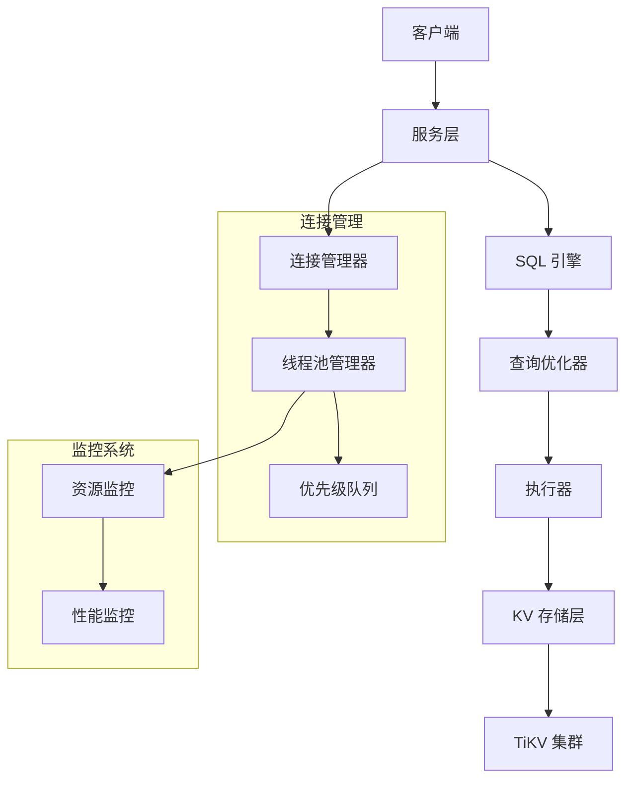
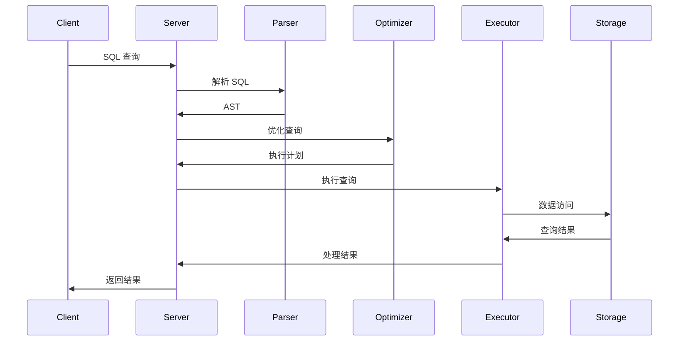
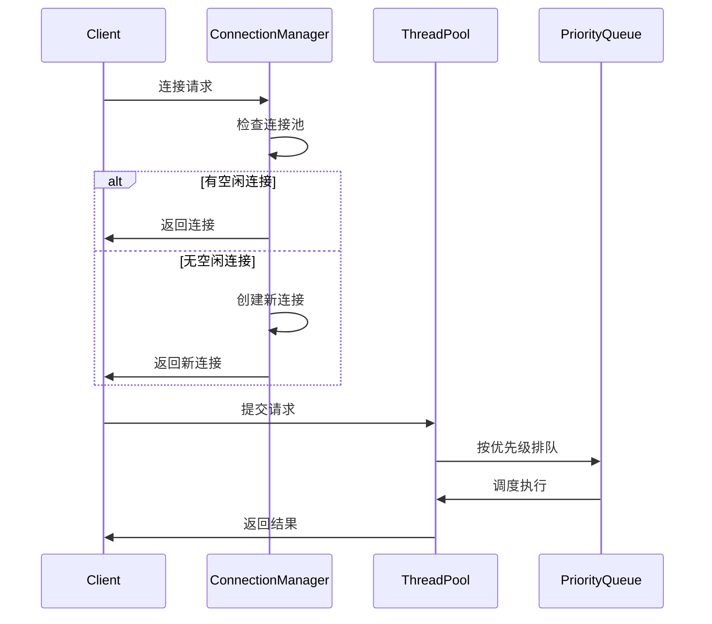

# SealDB 架构设计

## 系统概述

SealDB 是一个基于 Rust 开发的分布式数据库系统，采用 TiKV 作为底层存储引擎，提供高性能、高可用的数据存储和查询服务。

## 核心架构



## 模块设计

### 1. 服务层 (Server)

负责处理外部请求，包括：
- MySQL 协议支持
- HTTP API 接口
- 连接管理和认证

### 2. SQL 引擎 (SQL Engine)

#### 2.1 SQL 解析器 (Parser)
- 使用 `sqlparser-rs` 进行 SQL 语句解析
- 支持 SELECT、INSERT、UPDATE、DELETE、CREATE TABLE 等语句
- 生成抽象语法树 (AST)

#### 2.2 查询优化器 (Optimizer)

**基于规则的优化 (RBO)**:
- 常量折叠 (Constant Folding)
- 谓词下推 (Predicate Pushdown)
- 列裁剪 (Column Pruning)
- 连接重排序 (Join Reorder)
- 索引选择 (Index Selection)

**基于成本的优化 (CBO)**:
- 成本模型和统计信息
- 候选计划生成
- 最优计划选择

#### 2.3 执行器 (Executor)
- 执行优化后的查询计划
- 支持表扫描、索引扫描等操作
- 结果集处理和返回

### 3. 存储层 (Storage)

#### 3.1 KV 存储引擎
- 基于 TiKV 分布式存储
- 支持事务和 ACID 特性
- 高可用和水平扩展

#### 3.2 数据模型
- 键值对存储
- 支持复杂数据类型
- 索引和约束管理

### 4. 连接管理

#### 4.1 连接管理器
- 连接池管理
- 连接生命周期控制
- 负载均衡

#### 4.2 线程池管理器
- 多级优先级队列
- 资源监控和限制
- 动态线程调整

#### 4.3 请求优先级
```rust
pub enum RequestPriority {
    System,      // 系统级请求
    Admin,       // 管理请求
    High,        // 高优先级
    Normal,      // 普通请求
    Low,         // 低优先级
    Background,  // 后台任务
}
```

## 数据流

### 查询处理流程



### 连接管理流程



## 性能特性

### 1. 高并发处理
- 异步 I/O 模型
- 多线程并发执行
- 连接池复用

### 2. 智能调度
- 多级优先级队列
- 资源感知调度
- 动态负载均衡

### 3. 监控告警
- 实时资源监控
- 性能指标收集
- 自动告警机制

## 技术栈

- **语言**: Rust
- **异步运行时**: Tokio
- **存储引擎**: TiKV
- **SQL 解析**: sqlparser-rs
- **序列化**: Serde
- **错误处理**: thiserror + anyhow
- **日志**: tracing
- **系统监控**: sysinfo

## 扩展性设计

### 1. 模块化架构
- 松耦合的模块设计
- 插件化的功能扩展
- 标准化的接口定义

### 2. 水平扩展
- 无状态服务设计
- 分布式存储支持
- 负载均衡能力

### 3. 功能扩展
- 可插拔的优化规则
- 可扩展的执行计划
- 自定义函数支持 