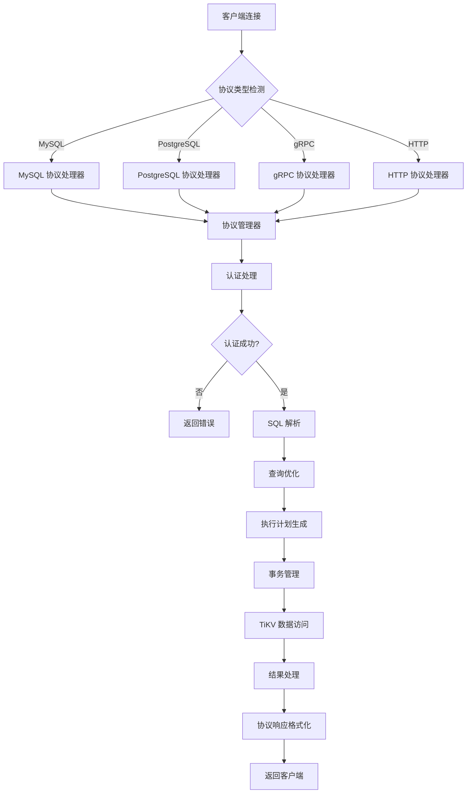
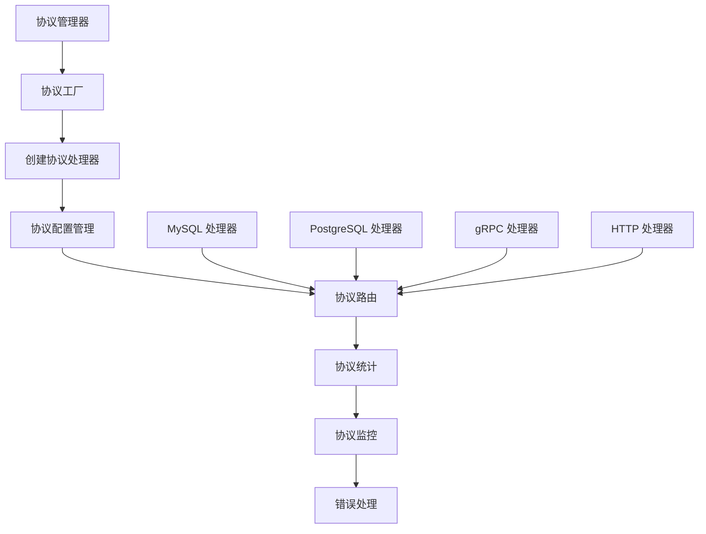

# SealDB 架构设计文档

## 概述

SealDB 是一个基于 TiKV 的分布式数据库系统，采用 C++ 实现，提供高性能的 SQL 查询和事务处理能力。系统采用模块化设计，具有良好的可扩展性和可维护性。

## 系统架构

### 整体架构图

```
┌─────────────────────────────────────────────────────────────┐
│                    客户端应用层                              │
│  ┌─────────────┐  ┌─────────────┐  ┌─────────────┐        │
│  │   MySQL     │  │ PostgreSQL  │  │   gRPC      │        │
│  │  客户端     │  │   客户端    │  │   客户端    │        │
│  └─────────────┘  └─────────────┘  └─────────────┘        │
│  ┌─────────────┐  ┌─────────────┐  ┌─────────────┐        │
│  │    HTTP     │  │   REST      │  │   GraphQL   │        │
│  │    API      │  │    API      │  │    API      │        │
│  └─────────────┘  └─────────────┘  └─────────────┘        │
└─────────────────────────────────────────────────────────────┘
                                │
┌─────────────────────────────────────────────────────────────┐
│                    协议层 (Protocol Layer)                  │
│  ┌─────────────┐  ┌─────────────┐  ┌─────────────┐        │
│  │  MySQL      │  │ PostgreSQL  │  │   gRPC      │        │
│  │  协议       │  │   协议      │  │   协议      │        │
│  │ (5.7/8.0)  │  │   (3.0)    │  │  (1.0)     │        │
│  └─────────────┘  └─────────────┘  └─────────────┘        │
│  ┌─────────────┐  ┌─────────────┐  ┌─────────────┐        │
│  │    HTTP     │  │   REST      │  │   GraphQL   │        │
│  │   协议      │  │   协议      │  │   协议      │        │
│  │  (1.1/2.0) │  │   (JSON)    │  │  (Schema)   │        │
│  └─────────────┘  └─────────────┘  └─────────────┘        │
└─────────────────────────────────────────────────────────────┘
                                │
┌─────────────────────────────────────────────────────────────┐
│                    协议管理器 (Protocol Manager)             │
│  ┌─────────────┐  ┌─────────────┐  ┌─────────────┐        │
│  │   协议      │  │   协议      │  │   协议      │        │
│  │   工厂      │  │   路由      │  │   统计      │        │
│  └─────────────┘  └─────────────┘  └─────────────┘        │
│  ┌─────────────┐  ┌─────────────┐  ┌─────────────┐        │
│  │   协议      │  │   协议      │  │   协议      │        │
│  │   配置      │  │   监控      │  │   错误      │        │
│  │   管理      │  │   管理      │  │   处理      │        │
│  └─────────────┘  └─────────────┘  └─────────────┘        │
└─────────────────────────────────────────────────────────────┘
                                │
┌─────────────────────────────────────────────────────────────┐
│                    服务层 (Server Layer)                    │
│  ┌─────────────┐  ┌─────────────┐  ┌─────────────┐        │
│  │  MySQL      │  │ PostgreSQL  │  │   gRPC      │        │
│  │  服务器     │  │   服务器    │  │   服务器    │        │
│  └─────────────┘  └─────────────┘  └─────────────┘        │
│  ┌─────────────┐  ┌─────────────┐  ┌─────────────┐        │
│  │    HTTP     │  │   连接      │  │   会话      │        │
│  │   服务器    │  │   管理器    │  │   管理器    │        │
│  └─────────────┘  └─────────────┘  └─────────────┘        │
└─────────────────────────────────────────────────────────────┘
                                │
┌─────────────────────────────────────────────────────────────┐
│                    SQL 处理层 (SQL Layer)                   │
│  ┌─────────────┐  ┌─────────────┐  ┌─────────────┐        │
│  │   解析器    │  │   优化器    │  │   执行器    │        │
│  │  (Parser)   │  │ (Optimizer) │  │(Executor)   │        │
│  └─────────────┘  └─────────────┘  └─────────────┘        │
└─────────────────────────────────────────────────────────────┘
                                │
┌─────────────────────────────────────────────────────────────┐
│                    核心层 (Core Layer)                      │
│  ┌─────────────┐  ┌─────────────┐  ┌─────────────┐        │
│  │   事务      │  │    锁       │  │   缓冲池    │        │
│  │   管理器    │  │   管理器    │  │  (Buffer    │        │
│  │(Transaction)│  │  (Lock)     │  │   Pool)     │        │
│  └─────────────┘  └─────────────┘  └─────────────┘        │
└─────────────────────────────────────────────────────────────┘
                                │
┌─────────────────────────────────────────────────────────────┐
│                    TiKV 客户端层 (TiKV Client)              │
│  ┌─────────────┐  ┌─────────────┐  ┌─────────────┐        │
│  │   TiKV      │  │   TiKV      │  │   TiKV      │        │
│  │   客户端    │  │   连接      │  │   存储      │        │
│  │  (Client)   │  │(Connection) │  │ (Storage)   │        │
│  └─────────────┘  └─────────────┘  └─────────────┘        │
└─────────────────────────────────────────────────────────────┘
                                │
┌─────────────────────────────────────────────────────────────┐
│                    TiKV 分布式存储层                        │
│  ┌─────────────┐  ┌─────────────┐  ┌─────────────┐        │
│  │   PD        │  │   TiKV      │  │   TiDB      │        │
│  │ (Placement  │  │   Server    │  │   Server    │        │
│  │   Driver)   │  │             │  │             │        │
│  └─────────────┘  └─────────────┘  └─────────────┘        │
└─────────────────────────────────────────────────────────────┘
```

## 核心组件

### 1. 高级线程池 (Advanced Thread Pool)

SealDB 实现了参考 PolarDB 和 TiDB 设计的高级线程池，具备以下特性：

#### 多级队列架构
- **CRITICAL**: 系统关键任务 (最高优先级)
- **HIGH**: 用户查询任务 (高优先级)
- **NORMAL**: 一般任务 (普通优先级)
- **LOW**: 后台任务 (低优先级)
- **BACKGROUND**: 维护任务 (最低优先级)

#### 自适应调度机制
- 动态监控系统资源使用情况
- 根据 CPU 使用率、内存使用率自动调整线程数
- 支持资源限制和超时保护
- 实时统计和监控

#### 资源管理
- CPU 使用率限制
- 内存使用量限制
- IO 操作频率限制
- 任务超时保护

### 2. 多协议支持 (Multi-Protocol Support)

SealDB 支持多种数据库协议，提供统一的接口和完整的协议管理：

#### 支持的协议
- **MySQL 协议**: 支持 MySQL 5.7/8.0 协议版本
- **PostgreSQL 协议**: 支持 PostgreSQL 3.0 协议版本
- **gRPC 协议**: 支持 gRPC 1.0 协议版本
- **HTTP/REST API**: 支持 HTTP 1.1/2.0 和 RESTful API
- **GraphQL API**: 支持 GraphQL 查询语言

#### 协议管理器特性
- **协议工厂**: 动态创建和管理不同协议的处理器
- **协议路由**: 根据连接类型自动路由到相应的协议处理器
- **协议统计**: 实时监控各协议的连接数和请求统计
- **协议配置**: 支持独立配置每种协议的参数
- **协议监控**: 提供详细的协议级别监控和错误处理

#### 协议处理器架构
- **统一接口**: 所有协议处理器实现相同的接口
- **版本兼容**: 支持多种协议版本的向后兼容
- **错误处理**: 统一的错误处理和消息格式化
- **性能优化**: 针对不同协议特点的性能优化

### 3. SQL 处理引擎

#### 解析器 (Parser)
- 词法分析 (Lexer)
- 语法分析 (Parser)
- 抽象语法树 (AST) 构建

#### 优化器 (Optimizer)
- 查询重写
- 成本估算
- 执行计划生成
- 索引选择

#### 执行器 (Executor)
- 计划执行
- 结果集处理
- 错误处理

### 4. 事务管理

#### ACID 特性支持
- **原子性 (Atomicity)**: 事务要么全部成功，要么全部失败
- **一致性 (Consistency)**: 事务执行前后数据库状态保持一致
- **隔离性 (Isolation)**: 并发事务之间相互隔离
- **持久性 (Durability)**: 已提交的事务永久保存

#### 锁管理
- 行级锁
- 表级锁
- 死锁检测
- 锁超时处理

### 5. TiKV 集成

#### 客户端功能
- 连接池管理
- 事务处理
- 存储接口
- 错误处理

#### 分布式特性
- 数据分片
- 负载均衡
- 故障恢复
- 一致性保证

## 数据流

### 多协议处理流程



### 协议管理器工作流程



### 事务处理流程

```
1. 开始事务
   ↓
2. 获取锁
   ↓
3. 执行操作
   ↓
4. 写入日志
   ↓
5. 提交/回滚
   ↓
6. 释放锁
```

## 性能优化

### 1. 线程池优化
- 多级队列减少锁竞争
- 自适应调度提高资源利用率
- 资源限制防止过载

### 2. 缓存策略
- 查询结果缓存
- 执行计划缓存
- 连接池复用

### 3. 索引优化
- 自动索引选择
- 复合索引支持
- 索引统计信息

### 4. 并发控制
- 乐观锁
- 悲观锁
- MVCC (多版本并发控制)

## 高可用设计

### 1. 故障检测
- 心跳检测
- 超时监控
- 错误统计

### 2. 故障恢复
- 自动重连
- 事务回滚
- 数据一致性检查

### 3. 负载均衡
- 连接分发
- 查询路由
- 资源监控

## 扩展性设计

### 1. 模块化架构
- 松耦合设计
- 插件化支持
- 接口标准化

### 2. 水平扩展
- 数据分片
- 读写分离
- 集群管理

### 3. 垂直扩展
- 资源动态调整
- 配置热更新
- 功能模块化

## 监控和运维

### 1. 性能监控
- 查询性能统计
- 资源使用监控
- 错误率统计

### 2. 日志管理
- 结构化日志
- 日志级别控制
- 日志轮转

### 3. 配置管理
- 配置文件热加载
- 参数动态调整
- 环境变量支持

## 安全设计

### 1. 访问控制
- 用户认证
- 权限管理
- 连接加密

### 2. 数据安全
- 传输加密
- 存储加密
- 审计日志

### 3. 网络安全
- 防火墙配置
- 端口管理
- 协议安全

## 未来规划

### 1. 功能增强
- 更多 SQL 语法支持
- 存储过程支持
- 触发器支持

### 2. 性能优化
- 查询优化器改进
- 缓存策略优化
- 并发性能提升

### 3. 生态集成
- 更多客户端支持
- 监控工具集成
- 云原生支持