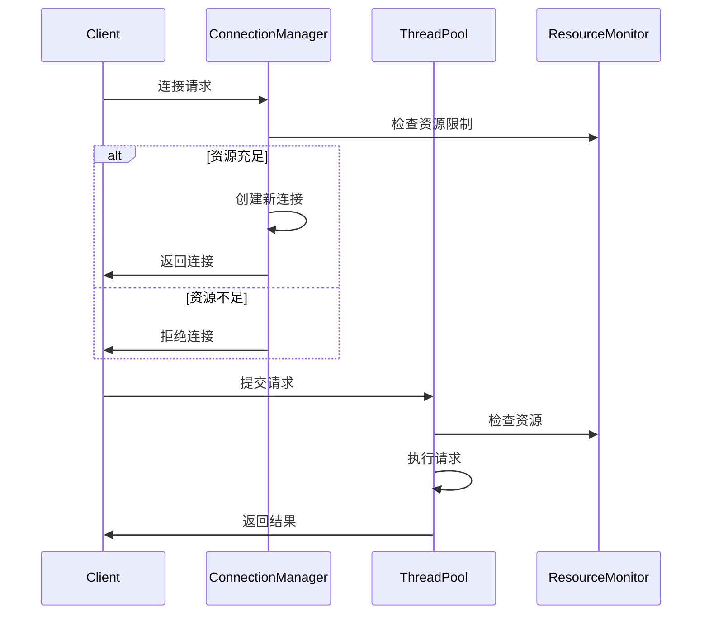
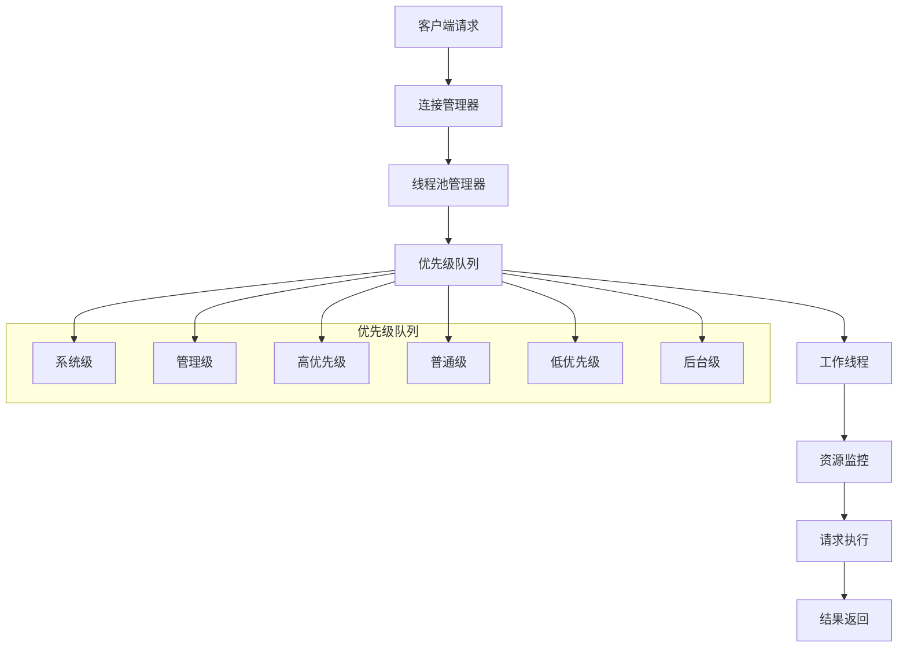

# 连接管理设计

## 概述

SealDB 的连接管理系统负责处理客户端连接、请求调度和资源管理，确保系统在高并发场景下的稳定性和性能。

## 核心组件

### 1. 连接管理器 (ConnectionManager)

#### 1.1 连接状态管理

```rust
pub enum ConnectionState {
    Idle,       // 空闲状态
    Active,     // 活跃状态
    Busy,       // 忙碌状态
    Closing,    // 关闭中
    Closed,     // 已关闭
}

pub struct Connection {
    pub id: ConnectionId,
    pub user_id: String,
    pub database: String,
    pub state: ConnectionState,
    pub created_at: DateTime<Utc>,
    pub last_used: DateTime<Utc>,
    pub request_count: u64,
}
```

#### 1.2 连接池实现

```rust
pub struct ConnectionManager {
    connections: Arc<RwLock<HashMap<ConnectionId, Connection>>>,
    idle_connections: Arc<RwLock<VecDeque<ConnectionId>>>,
    config: ConnectionConfig,
    stats: Arc<RwLock<ConnectionStats>>,
}

impl ConnectionManager {
    pub async fn get_connection(&self, user_id: String, database: String) -> Result<ConnectionId> {
        // 1. 检查空闲连接池
        if let Some(connection_id) = self.get_idle_connection().await {
            return Ok(connection_id);
        }

        // 2. 检查是否可以创建新连接
        if self.can_create_new_connection().await {
            return self.create_connection(user_id, database).await;
        }

        // 3. 等待可用连接
        self.wait_for_connection().await
    }
}
```

### 2. 线程池管理器 (ThreadPoolManager)

#### 2.1 多级优先级队列

```rust
pub enum RequestPriority {
    System,      // 系统级请求 (0)
    Admin,       // 管理请求 (1)
    High,        // 高优先级 (2)
    Normal,      // 普通请求 (3)
    Low,         // 低优先级 (4)
    Background,  // 后台任务 (5)
}

pub struct PriorityQueue {
    queues: Vec<VecDeque<Request>>,
    stats: Arc<RwLock<QueueStats>>,
}

impl PriorityQueue {
    pub fn push(&mut self, request: Request) {
        let priority = request.priority as usize;
        if priority < self.queues.len() {
            self.queues[priority].push_back(request);
        }
    }

    pub fn pop(&mut self) -> Option<Request> {
        for queue in &mut self.queues {
            if let Some(request) = queue.pop_front() {
                return Some(request);
            }
        }
        None
    }
}
```

#### 2.2 工作线程管理

```rust
pub struct Worker {
    id: WorkerId,
    priority_queue: Arc<Mutex<PriorityQueue>>,
    stats: Arc<RwLock<WorkerStats>>,
    resource_monitor: Arc<ResourceMonitor>,
}

impl Worker {
    pub async fn run(&mut self) {
        loop {
            // 1. 获取请求
            let request = {
                let mut queue = self.priority_queue.lock().await;
                queue.pop()
            };

            if let Some(request) = request {
                // 2. 执行请求
                let start_time = Instant::now();
                let result = self.execute_request(request).await;
                let duration = start_time.elapsed();

                // 3. 更新统计信息
                self.update_stats(duration, result.is_ok()).await;
            } else {
                // 4. 空闲等待
                tokio::time::sleep(Duration::from_millis(10)).await;
            }
        }
    }
}
```

### 3. 资源监控 (ResourceMonitor)

#### 3.1 系统资源监控

```rust
pub struct ResourceMonitor {
    cpu_usage: Arc<RwLock<f64>>,
    memory_usage: Arc<RwLock<usize>>,
    disk_usage: Arc<RwLock<usize>>,
    network_usage: Arc<RwLock<NetworkStats>>,
}

impl ResourceMonitor {
    pub async fn start_monitoring(&self) {
        let mut interval = tokio::time::interval(Duration::from_secs(1));

        loop {
            interval.tick().await;
            self.update_metrics().await;
        }
    }

    async fn update_metrics(&self) {
        let mut sys = System::new_all();
        sys.refresh_all();

        // CPU 使用率
        let cpu_usage = sys.global_cpu_info().cpu_usage();
        *self.cpu_usage.write().await = cpu_usage as f64;

        // 内存使用率
        let used_memory = sys.used_memory();
        *self.memory_usage.write().await = used_memory as usize;
    }
}
```

## 请求处理流程

### 1. 连接建立流程



### 2. 请求调度流程



## 性能优化

### 1. 连接池优化
- 预分配连接
- 连接复用
- 智能连接清理
- 连接健康检查

### 2. 线程池优化
- 动态线程调整
- 工作窃取算法
- 任务分片
- 负载均衡

### 3. 资源管理优化
- 实时资源监控
- 自适应资源限制
- 资源预测
- 自动扩缩容

## 监控指标

### 1. 连接指标
- 活跃连接数
- 空闲连接数
- 连接创建速率
- 连接错误率

### 2. 请求指标
- 请求处理速率
- 请求延迟
- 请求成功率
- 队列长度

### 3. 资源指标
- CPU 使用率
- 内存使用率
- 磁盘 I/O
- 网络 I/O

## 配置参数

### 1. 连接配置
```toml
[connection]
max_connections = 1000
max_idle_connections = 100
connection_timeout = 30
idle_timeout = 300
```

### 2. 线程池配置
```toml
[thread_pool]
min_workers = 4
max_workers = 32
queue_size = 10000
keep_alive_time = 60
```

### 3. 资源限制
```toml
[resource_limits]
max_cpu_usage = 0.8
max_memory_usage = 8589934592  # 8GB
max_disk_usage = 0.9
max_network_bandwidth = 104857600  # 100MB/s
```