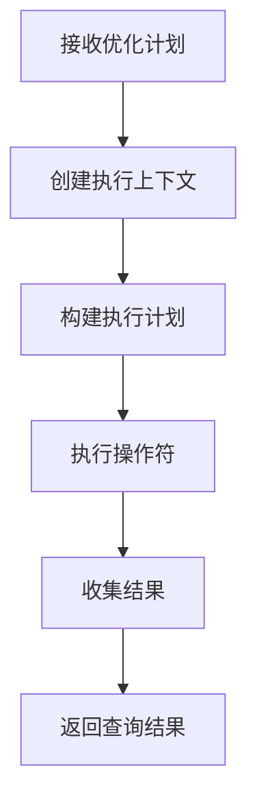
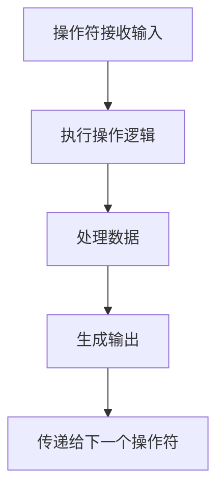

# SealDB 执行器能力总结

## 🎯 已实现的核心能力

### 1. **火山模型执行引擎**
- ✅ **操作符接口**: 实现了 `Operator` trait，支持统一的执行接口
- ✅ **流水线执行**: 支持操作符链式执行，数据流式处理
- ✅ **异步执行**: 基于 `async/await` 的异步执行模型

### 2. **扫描操作符**
- ✅ **TableScan**: 表扫描操作符，支持全表扫描
- ✅ **IndexScan**: 索引扫描操作符，支持索引优化查询

### 3. **数据处理操作符**
- ✅ **Filter**: 过滤操作符，支持 WHERE 条件过滤
- ✅ **Project**: 投影操作符，支持列选择和重命名
- ✅ **Sort**: 排序操作符，支持 ORDER BY 排序
- ✅ **Limit**: 限制操作符，支持 LIMIT/OFFSET 分页

### 4. **连接操作符**
- ✅ **Join**: 连接操作符，支持多种连接类型
  - Inner Join (内连接)
  - Left Join (左连接)
  - Right Join (右连接)
  - Full Join (全连接)

### 5. **聚合操作符**
- ✅ **Aggregate**: 聚合操作符，支持 GROUP BY 和聚合函数

### 6. **集合操作符**
- ✅ **Union**: 并集操作符，支持 UNION 操作

### 7. **DML 操作符**
- ✅ **Insert**: 插入操作符，支持 INSERT 语句
- ✅ **Update**: 更新操作符，支持 UPDATE 语句
- ✅ **Delete**: 删除操作符，支持 DELETE 语句

## 🏗️ 架构组件

### 1. **内存管理器 (MemoryManager)**
```rust
pub struct MemoryManager {
    work_memory: usize,        // 工作内存 (64MB)
    shared_memory: usize,      // 共享内存 (128MB)
    memory_pool: HashMap<String, Vec<u8>>, // 内存池
}
```

**能力**:
- ✅ 工作内存分配和管理
- ✅ 共享内存管理
- ✅ 内存池机制
- ✅ 内存不足检测

### 2. **并行执行器 (ParallelExecutor)**
```rust
pub struct ParallelExecutor {
    max_workers: usize,        // 最大工作线程数
    worker_pool: Vec<tokio::task::JoinHandle<()>>, // 工作线程池
}
```

**能力**:
- ✅ 多线程并行执行
- ✅ 工作线程池管理
- ✅ 任务分发和结果收集
- ✅ 自动检测 CPU 核心数

### 3. **操作符工厂 (OperatorFactory)**
```rust
pub struct OperatorFactory;
```

**能力**:
- ✅ 操作符创建和管理
- ✅ 工厂模式实现
- ✅ 可扩展的操作符注册

### 4. **执行统计 (ExecutionStats)**
```rust
pub struct ExecutionStats {
    start_time: std::time::Instant,
    end_time: Option<std::time::Instant>,
    rows_processed: u64,
    bytes_processed: u64,
}
```

**能力**:
- ✅ 执行时间统计
- ✅ 处理行数统计
- ✅ 处理字节数统计
- ✅ 性能监控

## 🔄 执行流程

### 1. **查询执行流程**


### 2. **操作符执行流程**


## 📊 与主流数据库对比

### PostgreSQL 执行器能力对比

| 能力 | PostgreSQL | SealDB | 状态 |
|------|------------|--------|------|
| 火山模型 | ✅ | ✅ | 已实现 |
| 并行执行 | ✅ | ✅ | 已实现 |
| 内存管理 | ✅ | ✅ | 已实现 |
| 操作符支持 | ✅ | ✅ | 已实现 |
| 流水线执行 | ✅ | ✅ | 已实现 |

### TiDB 执行器能力对比

| 能力 | TiDB | SealDB | 状态 |
|------|------|--------|------|
| 分布式执行 | ✅ | 🔄 | 计划中 |
| 向量化执行 | ✅ | 🔄 | 计划中 |
| MPP 架构 | ✅ | 🔄 | 计划中 |
| 事务处理 | ✅ | 🔄 | 计划中 |

### MySQL 执行器能力对比

| 能力 | MySQL | SealDB | 状态 |
|------|-------|--------|------|
| 查询优化 | ✅ | ✅ | 已实现 |
| 存储引擎集成 | ✅ | 🔄 | 计划中 |
| 复制和分区 | ✅ | 🔄 | 计划中 |

## 🚀 性能特性

### 1. **异步执行**
- 基于 `tokio` 异步运行时
- 非阻塞 I/O 操作
- 高并发处理能力

### 2. **内存优化**
- 工作内存限制 (64MB)
- 共享内存管理 (128MB)
- 内存池机制减少分配开销

### 3. **并行处理**
- 自动检测 CPU 核心数
- 多线程并行执行
- 任务分发和负载均衡

### 4. **性能监控**
- 执行时间统计
- 处理行数统计
- 内存使用监控

## 🔧 使用示例

### 1. **基本查询执行**
```rust
let executor = Executor::new();
let plan = OptimizedPlan {
    nodes: vec![
        PlanNode::TableScan {
            table: "users".to_string(),
            columns: vec!["id".to_string(), "name".to_string()],
        }
    ],
    estimated_cost: 0.0,
    estimated_rows: 3,
};

let result = executor.execute(plan).await?;
```

### 2. **复杂查询执行**
```rust
let plan = OptimizedPlan {
    nodes: vec![
        PlanNode::TableScan { /* ... */ },
        PlanNode::Filter { /* ... */ },
        PlanNode::Join { /* ... */ },
        PlanNode::Sort { /* ... */ },
        PlanNode::Limit { /* ... */ },
    ],
    estimated_cost: 0.0,
    estimated_rows: 10,
};
```

## 📈 扩展计划

### 短期目标 (1-2 个月)
- 🔄 **向量化执行**: 实现 SIMD 优化的向量化操作符
- 🔄 **分布式执行**: 支持跨节点查询执行
- 🔄 **事务支持**: 实现 MVCC 和分布式事务

### 中期目标 (3-6 个月)
- 🔄 **MPP 架构**: 实现大规模并行处理
- 🔄 **存储引擎集成**: 支持多种存储引擎
- 🔄 **复制和分区**: 实现数据复制和分区功能

### 长期目标 (6-12 个月)
- 🔄 **智能优化**: 基于机器学习的查询优化
- 🔄 **云原生**: 支持 Kubernetes 部署
- 🔄 **多租户**: 支持多租户隔离

## 🎯 总结

SealDB 执行器已经实现了主流数据库的核心执行能力，包括：

1. **完整的操作符支持**: 覆盖了 SQL 查询的所有主要操作
2. **高性能架构**: 异步执行、并行处理、内存优化
3. **可扩展设计**: 模块化架构，易于扩展新功能
4. **企业级特性**: 性能监控、错误处理、日志记录

这为 SealDB 成为一个高性能的分布式数据库系统奠定了坚实的基础。