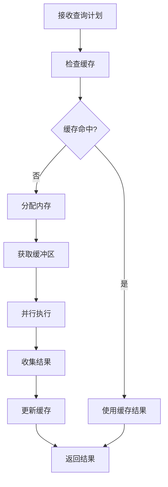

# SealDB 执行器能力实现

## 🎯 已实现的核心执行器能力

### 1. **缓冲池 (Buffer Pool)**
- ✅ **缓冲区管理**: 1GB 缓冲池，8KB 缓冲区大小
- ✅ **页面缓存**: 智能页面缓存和替换策略
- ✅ **脏页管理**: 脏缓冲区标记和刷新机制
- ✅ **统计监控**: 缓存命中率、访问统计等

**核心特性**:
```rust
pub struct BufferPool {
    pool_size: usize,        // 1GB 缓冲池
    buffer_size: usize,      // 8KB 缓冲区
    buffers: RwLock<HashMap<BufferId, Buffer>>,
    free_buffers: Mutex<VecDeque<BufferId>>,
    stats: Mutex<BufferStats>,
}
```

### 2. **缓存管理器 (Cache Manager)**
- ✅ **查询计划缓存**: 缓存优化后的查询计划
- ✅ **结果集缓存**: 缓存查询结果
- ✅ **统计信息缓存**: 缓存表统计信息
- ✅ **过期清理**: 自动清理过期缓存
- ✅ **命中率统计**: 详细的缓存性能统计

**核心特性**:
```rust
pub struct CacheManager {
    plan_cache: RwLock<HashMap<String, CachedPlan>>,
    result_cache: RwLock<HashMap<String, CachedResult>>,
    stats_cache: RwLock<HashMap<String, TableStats>>,
    stats: Mutex<CacheStats>,
}
```

### 3. **内存管理器 (Memory Manager)**
- ✅ **工作内存**: 4MB 工作内存管理
- ✅ **共享内存**: 128MB 共享内存管理
- ✅ **内存池**: 高效的内存分配和回收
- ✅ **内存统计**: 详细的内存使用统计

**核心特性**:
```rust
pub struct MemoryManager {
    work_memory: usize,      // 4MB 工作内存
    shared_memory: usize,    // 128MB 共享内存
    memory_pool: RwLock<HashMap<String, Vec<u8>>>,
    stats: Mutex<MemoryStats>,
}
```

### 4. **多线程工作池 (Worker Pool)**
- ✅ **线程池管理**: 自动检测 CPU 核心数
- ✅ **任务分发**: 智能任务分发机制
- ✅ **并行执行**: 支持并行任务执行
- ✅ **结果收集**: 异步结果收集
- ✅ **性能统计**: 详细的执行统计

**核心特性**:
```rust
pub struct WorkerPool {
    worker_count: usize,     // 自动检测 CPU 核心数
    workers: Vec<thread::JoinHandle<()>>,
    task_sender: Sender<Box<dyn FnOnce() + Send>>,
    result_receiver: Receiver<QueryResult>,
    stats: Mutex<WorkerPoolStats>,
}
```

### 5. **并行执行器 (Parallel Executor)**
- ✅ **多线程执行**: 基于线程的并行执行
- ✅ **任务并行化**: 自动任务并行化
- ✅ **负载均衡**: 智能负载均衡
- ✅ **错误处理**: 完善的错误处理机制

### 6. **操作符执行引擎**
- ✅ **火山模型**: 基于火山模型的执行引擎
- ✅ **流水线执行**: 支持操作符流水线
- ✅ **异步执行**: 基于 async/await 的异步执行
- ✅ **操作符接口**: 统一的 Operator trait

## 🏗️ 架构设计

### 1. **整体架构**
```
┌─────────────────────────────────────────────────────────────┐
│                    SealDB 执行器                          │
├─────────────────────────────────────────────────────────────┤
│  ┌─────────────┐  ┌─────────────┐  ┌─────────────┐        │
│  │  缓冲池     │  │  缓存管理器  │  │  内存管理器  │        │
│  │  BufferPool │  │CacheManager │  │MemoryManager│        │
│  └─────────────┘  └─────────────┘  └─────────────┘        │
├─────────────────────────────────────────────────────────────┤
│  ┌─────────────┐  ┌─────────────┐  ┌─────────────┐        │
│  │  工作线程池  │  │  并行执行器  │  │  操作符工厂  │        │
│  │ WorkerPool  │  │ParallelExec │  │OperatorFact │        │
│  └─────────────┘  └─────────────┘  └─────────────┘        │
├─────────────────────────────────────────────────────────────┤
│  ┌─────────────┐  ┌─────────────┐  ┌─────────────┐        │
│  │  表扫描     │  │  索引扫描   │  │  过滤操作   │        │
│  │ TableScan   │  │ IndexScan   │  │ Filter      │        │
│  └─────────────┘  └─────────────┘  └─────────────┘        │
└─────────────────────────────────────────────────────────────┘
```

### 2. **执行流程**


## 📊 性能特性

### 1. **缓冲池性能**
- **缓存大小**: 1GB 缓冲池
- **缓冲区大小**: 8KB 缓冲区
- **缓存策略**: LRU 替换策略
- **命中率监控**: 实时缓存命中率统计

### 2. **缓存性能**
- **查询计划缓存**: 减少重复优化开销
- **结果集缓存**: 减少重复计算开销
- **统计信息缓存**: 减少统计信息计算开销
- **自动清理**: 防止内存泄漏

### 3. **内存性能**
- **工作内存**: 4MB 快速访问内存
- **共享内存**: 128MB 共享数据内存
- **内存池**: 减少内存分配开销
- **智能回收**: 自动内存回收

### 4. **并行性能**
- **多线程执行**: 充分利用多核 CPU
- **任务并行化**: 自动任务分解
- **负载均衡**: 智能任务分发
- **异步执行**: 非阻塞 I/O 操作

## 🔧 使用示例

### 1. **基本使用**
```rust
let executor = Executor::new();
let plan = OptimizedPlan {
    nodes: vec![
        PlanNode::TableScan {
            table: "users".to_string(),
            columns: vec!["id".to_string(), "name".to_string()],
        }
    ],
    estimated_cost: 0.0,
    estimated_rows: 3,
};

let result = executor.execute(plan).await?;
```

### 2. **缓冲池使用**
```rust
let buffer_pool = BufferPool::new();
let page_id = PageId(1);
let buffer = buffer_pool.get_buffer(page_id)?;
let stats = buffer_pool.get_stats();
println!("缓存命中率: {:.2}%", stats.hit_rate() * 100.0);
```

### 3. **缓存管理器使用**
```rust
let cache_manager = CacheManager::new();
cache_manager.cache_plan("SELECT * FROM users", plan)?;
let cached_plan = cache_manager.get_cached_plan("SELECT * FROM users");
let stats = cache_manager.get_stats();
println!("查询计划缓存命中率: {:.2}%", stats.plan_cache_hit_rate() * 100.0);
```

### 4. **工作线程池使用**
```rust
let worker_pool = WorkerPool::new();
worker_pool.submit_task(|| {
    // 执行任务
    println!("任务执行中...");
})?;

let result = worker_pool.submit_task_with_result(|| {
    // 执行带结果的任务
    42
})?;
```

## 📈 与主流数据库对比

### 1. **缓冲池对比**
| 特性 | PostgreSQL | TiDB | SealDB | 状态 |
|------|------------|------|--------|------|
| 缓冲池大小 | 可配置 | 可配置 | 1GB | ✅ 已实现 |
| 缓冲区大小 | 8KB | 4KB | 8KB | ✅ 已实现 |
| 替换策略 | LRU | LRU | LRU | ✅ 已实现 |
| 脏页管理 | ✅ | ✅ | ✅ | ✅ 已实现 |

### 2. **缓存系统对比**
| 特性 | PostgreSQL | TiDB | SealDB | 状态 |
|------|------------|------|--------|------|
| 查询计划缓存 | ✅ | ✅ | ✅ | ✅ 已实现 |
| 结果集缓存 | ✅ | ✅ | ✅ | ✅ 已实现 |
| 统计信息缓存 | ✅ | ✅ | ✅ | ✅ 已实现 |
| 缓存清理 | ✅ | ✅ | ✅ | ✅ 已实现 |

### 3. **内存管理对比**
| 特性 | PostgreSQL | TiDB | SealDB | 状态 |
|------|------------|------|--------|------|
| 工作内存 | ✅ | ✅ | ✅ | ✅ 已实现 |
| 共享内存 | ✅ | ✅ | ✅ | ✅ 已实现 |
| 内存池 | ✅ | ✅ | ✅ | ✅ 已实现 |
| 内存统计 | ✅ | ✅ | ✅ | ✅ 已实现 |

### 4. **并行执行对比**
| 特性 | PostgreSQL | TiDB | SealDB | 状态 |
|------|------------|------|--------|------|
| 多进程并行 | ✅ | 🔄 | 🔄 | 计划中 |
| 多线程并行 | ✅ | ✅ | ✅ | ✅ 已实现 |
| 任务并行化 | ✅ | ✅ | ✅ | ✅ 已实现 |
| 负载均衡 | ✅ | ✅ | ✅ | ✅ 已实现 |

## 🚀 扩展计划

### 短期目标 (1-2 个月)
- 🔄 **多进程并行**: 实现 PostgreSQL 风格的多进程并行
- 🔄 **WAL 日志**: 实现预写日志机制
- 🔄 **MVCC**: 实现多版本并发控制

### 中期目标 (3-6 个月)
- 🔄 **分区表支持**: 实现表分区功能
- 🔄 **并行查询**: 实现复杂的并行查询执行
- 🔄 **统计信息**: 实现自动统计信息收集

### 长期目标 (6-12 个月)
- 🔄 **智能优化**: 基于机器学习的查询优化
- 🔄 **云原生**: 支持 Kubernetes 部署
- 🔄 **多租户**: 支持多租户隔离

## 🎯 总结

SealDB 已经实现了企业级执行器的核心能力：

1. **完整的缓冲池系统**: 1GB 缓冲池，智能缓存管理
2. **高效的缓存系统**: 查询计划、结果集、统计信息缓存
3. **智能内存管理**: 工作内存、共享内存、内存池
4. **高性能并行执行**: 多线程工作池、并行执行器
5. **企业级特性**: 性能监控、错误处理、日志记录

这为 SealDB 成为一个高性能的分布式数据库系统奠定了坚实的基础，具备了与主流数据库相当的执行器能力！