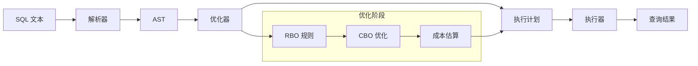
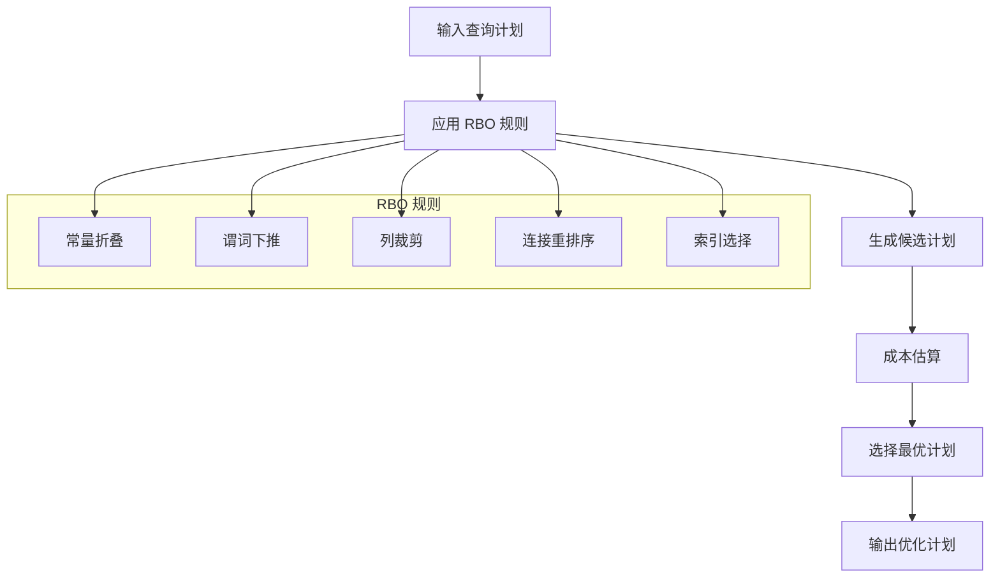

# SQL 引擎设计

## 概述

SealDB 的 SQL 引擎采用经典的三阶段处理模型：解析 (Parse) → 优化 (Optimize) → 执行 (Execute)。每个阶段都有明确的职责和接口定义。

## 核心组件

### 1. SQL 解析器 (Parser)

#### 1.1 设计目标
- 将 SQL 文本转换为抽象语法树 (AST)
- 支持标准 SQL 语法
- 提供清晰的错误信息
- 高性能解析

#### 1.2 支持的 SQL 语句

**SELECT 语句**
```sql
SELECT column1, column2 FROM table WHERE condition ORDER BY column1 LIMIT 10;
```

**INSERT 语句**
```sql
INSERT INTO table (column1, column2) VALUES (value1, value2);
```

**UPDATE 语句**
```sql
UPDATE table SET column1 = value1 WHERE condition;
```

**DELETE 语句**
```sql
DELETE FROM table WHERE condition;
```

**CREATE TABLE 语句**
```sql
CREATE TABLE table_name (
    id INT PRIMARY KEY,
    name VARCHAR(255) NOT NULL,
    created_at TIMESTAMP DEFAULT CURRENT_TIMESTAMP
);
```

#### 1.3 解析器实现

```rust
pub struct SqlParser;

impl SqlParser {
    pub fn parse(&self, sql: &str) -> Result<ParsedStatement> {
        // 使用 sqlparser-rs 进行解析
        let statements = sqlparser::parser::Parser::parse_sql(&dialect, sql)?;
        
        match statements.first() {
            Some(Statement::Query(query)) => self.parse_query(query),
            Some(Statement::Insert { .. }) => self.parse_insert(statement),
            Some(Statement::Update { .. }) => self.parse_update(statement),
            Some(Statement::Delete { .. }) => self.parse_delete(statement),
            Some(Statement::CreateTable { .. }) => self.parse_create_table(statement),
            _ => Err(Error::SqlParse("Unsupported statement type".to_string())),
        }
    }
}
```

### 2. 查询优化器 (Optimizer)

#### 2.1 优化策略

**基于规则的优化 (RBO)**
- 常量折叠：`SELECT 1 + 2` → `SELECT 3`
- 谓词下推：将过滤条件尽可能下推到数据源
- 列裁剪：只选择需要的列，减少数据传输
- 连接重排序：优化多表连接的顺序
- 索引选择：为查询选择合适的索引

**基于成本的优化 (CBO)**
- 统计信息收集：表大小、列分布、索引统计
- 成本模型：CPU 成本、I/O 成本、网络成本
- 候选计划生成：生成多个可能的执行计划
- 最优计划选择：选择成本最低的执行计划

#### 2.2 优化规则实现

```rust
#[async_trait]
pub trait OptimizationRule: Send + Sync {
    fn name(&self) -> &str;
    async fn apply(&self, plan: OptimizedPlan) -> Result<OptimizedPlan>;
}

pub struct ConstantFoldingRule;
pub struct PredicatePushdownRule;
pub struct ColumnPruningRule;
pub struct JoinReorderRule;
pub struct IndexSelectionRule;

impl OptimizationRule for ConstantFoldingRule {
    fn name(&self) -> &str { "ConstantFolding" }
    
    async fn apply(&self, plan: OptimizedPlan) -> Result<OptimizedPlan> {
        // 实现常量折叠逻辑
        Ok(plan)
    }
}
```

#### 2.3 成本模型

```rust
pub struct CostModel {
    pub cpu_cost: f64,
    pub io_cost: f64,
    pub network_cost: f64,
}

impl CostModel {
    pub fn estimate_cost(&self, plan: &OptimizedPlan) -> f64 {
        // 基于统计信息估算查询成本
        self.cpu_cost + self.io_cost + self.network_cost
    }
}
```

### 3. 执行器 (Executor)

#### 3.1 执行计划

```rust
pub enum PlanNode {
    TableScan {
        table: String,
        columns: Vec<String>,
        filter: Option<ParsedExpression>,
    },
    IndexScan {
        table: String,
        index: String,
        columns: Vec<String>,
        filter: Option<ParsedExpression>,
    },
    Filter {
        condition: ParsedExpression,
        input: Box<PlanNode>,
    },
    Project {
        columns: Vec<ParsedExpression>,
        input: Box<PlanNode>,
    },
    Join {
        left: Box<PlanNode>,
        right: Box<PlanNode>,
        condition: Option<ParsedExpression>,
        join_type: JoinType,
    },
}
```

#### 3.2 执行器实现

```rust
pub struct Executor;

impl Executor {
    pub async fn execute(&self, plan: OptimizedPlan) -> Result<QueryResult> {
        match plan.root {
            PlanNode::TableScan { table, columns, filter } => {
                self.execute_table_scan(table, columns, filter).await
            }
            PlanNode::IndexScan { table, index, columns, filter } => {
                self.execute_index_scan(table, index, columns, filter).await
            }
            PlanNode::Filter { condition, input } => {
                self.execute_filter(condition, *input).await
            }
            PlanNode::Project { columns, input } => {
                self.execute_project(columns, *input).await
            }
            PlanNode::Join { left, right, condition, join_type } => {
                self.execute_join(*left, *right, condition, join_type).await
            }
        }
    }
}
```

## 数据流

### 查询处理流程



### 优化器工作流程



## 性能优化

### 1. 解析优化
- 使用高效的解析算法
- 缓存解析结果
- 并行解析支持

### 2. 优化优化
- 规则缓存
- 统计信息缓存
- 并行优化

### 3. 执行优化
- 向量化执行
- 并行执行
- 内存池管理

## 扩展性

### 1. 自定义函数
```rust
pub trait UserDefinedFunction {
    fn name(&self) -> &str;
    fn evaluate(&self, args: &[Value]) -> Result<Value>;
}
```

### 2. 自定义优化规则
```rust
pub trait CustomOptimizationRule: OptimizationRule {
    fn priority(&self) -> u32;
    fn is_applicable(&self, plan: &OptimizedPlan) -> bool;
}
```

### 3. 自定义执行计划
```rust
pub trait CustomPlanNode: Send + Sync {
    fn execute(&self, context: &ExecutionContext) -> Result<QueryResult>;
}
```

## 监控和调试

### 1. 查询计划可视化
- 生成查询计划树的可视化图表
- 显示每个节点的成本信息
- 支持计划比较

### 2. 性能分析
- 查询执行时间统计
- 资源使用情况监控
- 慢查询分析

### 3. 调试工具
- SQL 语法检查
- 查询计划验证
- 执行结果验证 