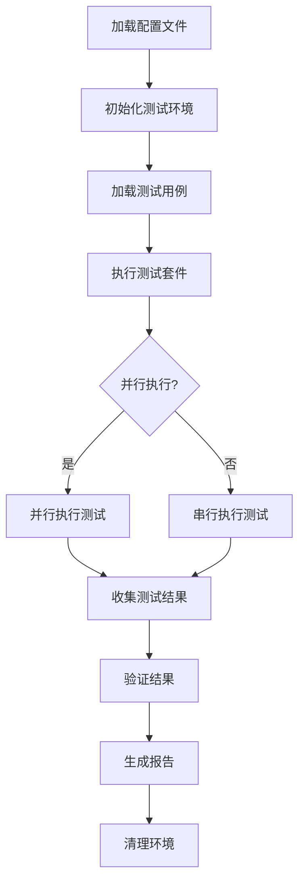

# SealDB 测试框架

## 📋 概述

SealDB 测试框架是一个类似 PostgreSQL regress 和 MySQL MTR (MySQL Test Run) 的完整测试系统，专为分布式数据库系统设计。它提供了企业级的测试能力，支持多种测试类型、灵活的配置、详细的报告，并且易于扩展和维护。

**🎯 设计目标**
- **高性能**: 基于 Rust 实现，提供毫秒级响应
- **零依赖**: 纯 Rust 实现，无需 Python 或其他外部依赖
- **可扩展**: 模块化架构，易于添加新功能
- **企业级**: 完整的监控、报告和 CI/CD 集成
- **兼容性**: 类似主流数据库测试框架的使用体验

## 🏗️ 架构设计

### 整体架构

```
┌─────────────────────────────────────────────────────────────┐
│                    SealDB 测试框架                          │
│                     (纯 Rust 实现)                          │
├─────────────────────────────────────────────────────────────┤
│  ┌─────────────┐  ┌─────────────┐  ┌─────────────┐        │
│  │  核心引擎    │  │  测试执行器  │  │  结果验证器  │        │
│  │  Core       │  │  Runner     │  │  Checker    │        │
│  └─────────────┘  └─────────────┘  └─────────────┘        │
├─────────────────────────────────────────────────────────────┤
│  ┌─────────────┐  ┌─────────────┐  ┌─────────────┐        │
│  │  性能监控器  │  │  报告生成器  │  │  配置管理器  │        │
│  │  Monitor    │  │  Reporter   │  │  Config     │        │
│  └─────────────┘  └─────────────┘  └─────────────┘        │
├─────────────────────────────────────────────────────────────┤
│  ┌─────────────┐  ┌─────────────┐  ┌─────────────┐        │
│  │  SQL 测试   │  │  命令行接口  │  │  数据连接器  │        │
│  │  SQL Tests  │  │  CLI        │  │  Database   │        │
│  └─────────────┘  └─────────────┘  └─────────────┘        │
└─────────────────────────────────────────────────────────────┘
```

### 核心组件

#### 1. **Rust 核心引擎** (`core/`)
- **测试运行器** (`test_runner.rs`): 执行测试用例，管理测试生命周期
- **结果检查器** (`result_checker.rs`): 验证测试结果，支持多种验证方式
- **性能监控器** (`performance_monitor.rs`): 收集系统性能指标
- **报告生成器** (`report_generator.rs`): 生成详细的测试报告
- **测试框架** (`test_framework.rs`): 主程序逻辑和命令行接口

#### 2. **测试套件** (`suites/`)
- **基础测试** (`basic/`): 基本 SQL 功能测试
- **高级测试** (`advanced/`): 复杂查询和功能测试
- **优化器测试** (`optimizer/`): 查询优化器测试
- **性能测试** (`performance/`): 性能基准测试
- **回归测试** (`regression/`): 功能回归验证

#### 3. **配置系统** (`config/`)
- **主配置文件** (`test_config.yaml`): 框架的核心配置
- **数据库配置**: 连接参数和特定设置
- **测试套件配置**: 各种测试类型的配置

## 🔧 核心原理

### 测试执行流程



### 结果验证机制

#### 1. **精确匹配**
```sql
-- 测试查询
SELECT * FROM users WHERE id = 1;

-- 期望结果
-- id | name
-- 1  | Alice
```

#### 2. **模糊匹配**
```yaml
result_validation:
  tolerance: 0.01  # 允许 1% 的误差
  ignore_whitespace: true
  case_sensitive: false
```

#### 3. **模式匹配**
```sql
-- 使用正则表达式验证结果
SELECT name FROM users WHERE name REGEXP '^A.*';
```

#### 4. **性能阈值**
```yaml
performance_thresholds:
  max_execution_time_ms: 1000
  min_throughput_qps: 1000.0
  max_memory_usage_mb: 512.0
```

### 性能监控原理

#### 系统指标收集
- **CPU 使用率**: 实时监控处理器负载
- **内存使用**: 跟踪内存分配和释放
- **网络 I/O**: 监控网络流量
- **磁盘 I/O**: 跟踪磁盘读写操作
- **查询延迟**: 测量 SQL 执行时间

#### 性能分析
```rust
pub struct PerformanceMetrics {
    pub execution_time_ms: u64,
    pub memory_usage_mb: f64,
    pub cpu_usage_percent: f64,
    pub throughput_qps: f64,
    pub network_io_kb: f64,
    pub disk_io_kb: f64,
}
```

## 🚀 使用方法

### 快速开始

#### 1. **编译测试框架**
```bash
# 进入测试框架目录
cd test_framework

# 编译测试框架
make build

# 或者直接使用 cargo
cargo build --release
```

#### 2. **运行测试**
```bash
# 运行所有测试
make test

# 运行特定测试套件
make test-basic
make test-performance

# 并行执行
make parallel-test
```

#### 3. **生成报告**
```bash
# 生成 Markdown 报告
make report

# 查看测试摘要
cat test_results.json
```

### 高级用法

#### 1. **直接使用二进制文件**
```bash
# 运行所有测试
./target/release/test-framework

# 运行特定套件
./target/release/test-framework --suite basic performance

# 并行执行
./target/release/test-framework --parallel

# 详细输出
./target/release/test-framework --verbose
```

#### 2. **自定义配置**
```yaml
# config/test_config.yaml
database:
  host: localhost
  port: 4000
  username: root
  password: ""

test_suites:
  custom_suite:
    enabled: true
    parallel: true
    timeout_seconds: 60
    test_cases_dir: "suites/custom"
```

#### 3. **创建测试用例**
```sql
-- suites/basic/my_test.sql
-- 测试名称: 自定义测试
-- 描述: 验证特定功能
-- 标签: custom, feature

-- 准备数据
CREATE TABLE test_table (id INT, name VARCHAR(50));
INSERT INTO test_table VALUES (1, 'test');

-- 测试查询
SELECT * FROM test_table WHERE id = 1;

-- 期望结果
-- id | name
-- 1  | test

-- 清理
DROP TABLE test_table;
```

### Makefile 命令

| 命令 | 描述 |
|------|------|
| `make build` | 编译测试框架 |
| `make test` | 运行所有测试 |
| `make test-basic` | 运行基本 SQL 测试 |
| `make test-performance` | 运行性能测试 |
| `make test-suite SUITE=basic` | 运行指定测试套件 |
| `make benchmark` | 运行基准测试 |
| `make stress-test` | 运行压力测试 |
| `make report` | 生成测试报告 |
| `make clean` | 清理测试环境 |
| `make parallel-test` | 并行执行测试 |
| `make verbose-test` | 详细输出模式 |

## 📊 测试类型

### 1. **SQL 功能测试**
- **基本查询**: SELECT, INSERT, UPDATE, DELETE
- **复杂查询**: JOIN, 子查询, 聚合函数
- **DDL 操作**: CREATE, ALTER, DROP
- **事务处理**: BEGIN, COMMIT, ROLLBACK
- **索引操作**: CREATE INDEX, DROP INDEX

### 2. **性能基准测试**
- **吞吐量测试**: 测量 QPS (每秒查询数)
- **延迟测试**: 测量查询响应时间
- **并发测试**: 多用户并发访问
- **压力测试**: 长时间高负载运行
- **资源监控**: CPU, 内存, 磁盘, 网络

### 3. **回归测试**
- **功能回归**: 确保新功能不破坏现有功能
- **性能回归**: 确保性能不会下降
- **兼容性测试**: 确保向后兼容
- **错误处理**: 验证错误处理机制

### 4. **兼容性测试**
- **SQL 标准**: 验证 SQL 标准兼容性
- **MySQL 兼容**: 测试 MySQL 语法兼容性
- **PostgreSQL 兼容**: 测试 PostgreSQL 语法兼容性
- **应用程序兼容**: 测试应用程序兼容性

## 🔍 配置详解

### 数据库配置
```yaml
database:
  host: localhost          # 数据库主机
  port: 4000              # 数据库端口
  username: root           # 用户名
  password: ""             # 密码
  database: test           # 数据库名
  connection_timeout: 30   # 连接超时 (秒)
  query_timeout: 60        # 查询超时 (秒)
  max_connections: 10      # 最大连接数
```

### 测试套件配置
```yaml
test_suites:
  basic:
    enabled: true          # 是否启用
    description: "基本 SQL 功能测试"
    parallel: false        # 是否并行执行
    retry_count: 3         # 重试次数
    timeout_seconds: 30    # 超时时间
    test_cases_dir: "suites/basic"  # 测试用例目录
```

### 性能阈值配置
```yaml
performance_thresholds:
  max_execution_time_ms: 1000    # 最大执行时间
  min_throughput_qps: 1000.0     # 最小吞吐量
  max_memory_usage_mb: 512.0     # 最大内存使用
  max_cpu_usage_percent: 80.0    # 最大 CPU 使用率
  max_network_io_kb: 1024.0      # 最大网络 I/O
  max_disk_io_kb: 512.0          # 最大磁盘 I/O
```

### 结果验证配置
```yaml
result_validation:
  exact_match: true        # 精确匹配
  case_sensitive: false    # 大小写敏感
  ignore_whitespace: true  # 忽略空白字符
  tolerance: 0.01          # 容差
  max_diff_rows: 10        # 最大差异行数
  allow_partial_match: false  # 允许部分匹配
```

## 📈 报告系统

### Markdown 报告
- **测试摘要**: 总体统计信息
- **详细结果**: 每个测试的详细结果
- **性能指标**: 性能数据展示
- **失败详情**: 失败测试的详细信息
- **执行时间**: 测试执行时间统计

### JSON 报告
```json
{
  "summary": {
    "total_tests": 150,
    "passed_tests": 145,
    "failed_tests": 5,
    "pass_rate": 96.7,
    "generation_time": "2024-01-15 10:30:00"
  },
  "suites": {
    "basic": {
      "total": 50,
      "passed": 48,
      "failed": 2,
      "pass_rate": 96.0,
      "results": [...]
    }
  }
}
```

### 性能报告
- **执行时间分布**: 查询执行时间统计
- **吞吐量对比**: 不同测试的吞吐量
- **资源使用**: CPU, 内存, 磁盘使用情况
- **性能趋势**: 历史性能数据

## 🔧 扩展开发

### 添加新的测试类型

#### 1. **创建测试用例**
```sql
-- suites/custom/new_feature.sql
-- 测试名称: 新功能测试
-- 描述: 测试新实现的功能
-- 标签: custom, new-feature

-- 测试代码
SELECT new_function(1, 2);

-- 期望结果
-- new_function
-- 3
```

#### 2. **注册测试套件**
```yaml
# config/test_config.yaml
test_suites:
  custom:
    enabled: true
    description: "自定义功能测试"
    parallel: false
    retry_count: 2
    timeout_seconds: 60
    test_cases_dir: "suites/custom"
```

#### 3. **运行新测试**
```bash
make test-suite SUITE=custom
```

### 自定义验证器

#### 1. **创建验证器结构体**
```rust
// core/src/custom_validator.rs
pub struct CustomValidator {
    config: ValidationConfig,
}

impl CustomValidator {
    pub fn validate(&self, actual_result: &QueryResult, expected_result: &ExpectedResult) -> Result<()> {
        // 实现自定义验证逻辑
        if self.custom_logic(actual_result, expected_result) {
            Ok(())
        } else {
            Err(anyhow!("自定义验证失败"))
        }
    }

    fn custom_logic(&self, actual: &QueryResult, expected: &ExpectedResult) -> bool {
        // 自定义验证逻辑
        true
    }
}
```

#### 2. **注册验证器**
```yaml
# config/test_config.yaml
extensions:
  custom_validators:
    - name: "custom_validator"
      class: "CustomValidator"
      enabled: true
```

### 自定义报告器

#### 1. **创建报告器结构体**
```rust
// core/src/custom_reporter.rs
pub struct CustomReporter {
    config: ReportConfig,
}

impl CustomReporter {
    pub fn generate_report(&self, results: &HashMap<String, Vec<TestResult>>) -> String {
        // 生成自定义报告
        "自定义报告内容".to_string()
    }
}
```

#### 2. **注册报告器**
```yaml
# config/test_config.yaml
extensions:
  custom_reporters:
    - name: "custom_reporter"
      class: "CustomReporter"
      enabled: true
```

## 🔄 CI/CD 集成

### GitHub Actions
```yaml
# .github/workflows/test.yml
name: Test Framework

on: [push, pull_request]

jobs:
  test:
    runs-on: ubuntu-latest
    steps:
      - uses: actions/checkout@v2
      - name: Setup Rust
        uses: actions-rs/toolchain@v1
        with:
          toolchain: stable
      - name: Build and Test
        run: |
          cd test_framework
          make ci-test
      - name: Generate Report
        run: |
          cd test_framework
          make report
      - name: Upload results
        uses: actions/upload-artifact@v2
        with:
          name: test-results
          path: test_framework/reports/
```

### Jenkins Pipeline
```groovy
pipeline {
    agent any

    stages {
        stage('Build') {
            steps {
                sh 'cd test_framework && make build'
            }
        }

        stage('Test') {
            steps {
                sh 'cd test_framework && make test'
            }
        }

        stage('Report') {
            steps {
                sh 'cd test_framework && make report'
                publishHTML([
                    allowMissing: false,
                    alwaysLinkToLastBuild: true,
                    keepAll: true,
                    reportDir: 'test_framework/reports',
                    reportFiles: 'test_report.md',
                    reportName: 'Test Report'
                ])
            }
        }
    }
}
```

## 🐛 故障排除

### 常见问题

#### 1. **编译失败**
```bash
# 检查 Rust 版本
rustc --version

# 更新 Rust
rustup update

# 清理并重新编译
cargo clean
cargo build --release
```

#### 2. **数据库连接失败**
```bash
# 检查数据库服务
systemctl status sealdb

# 检查端口
netstat -tlnp | grep 4000

# 检查配置文件
cat config/test_config.yaml
```

#### 3. **测试执行超时**
```yaml
# 增加超时时间
test_suites:
  basic:
    timeout_seconds: 60  # 从 30 增加到 60
```

#### 4. **内存不足**
```yaml
# 调整性能阈值
performance_thresholds:
  max_memory_usage_mb: 1024.0  # 增加内存限制
```

### 调试模式

#### 1. **启用详细日志**
```bash
RUST_LOG=debug ./target/release/test-framework run
```

#### 2. **调试配置**
```yaml
debug:
  enabled: true
  verbose_sql: true
  show_query_plans: true
```

#### 3. **性能分析**
```bash
# 使用 cargo-flamegraph 进行性能分析
cargo install flamegraph
cargo flamegraph --bin test-framework
```

## 📚 最佳实践

### 1. **测试用例设计**
- **独立性**: 每个测试用例应该独立运行
- **可重复性**: 测试结果应该一致
- **简洁性**: 测试用例应该简单明了
- **完整性**: 覆盖所有重要功能

### 2. **性能测试**
- **基准测试**: 建立性能基准
- **回归测试**: 防止性能下降
- **压力测试**: 验证系统极限
- **监控指标**: 持续监控关键指标

### 3. **配置管理**
- **环境分离**: 开发、测试、生产环境分离
- **版本控制**: 配置文件纳入版本控制
- **参数化**: 使用环境变量和参数
- **文档化**: 详细记录配置说明

### 4. **报告和监控**
- **自动化报告**: 自动生成测试报告
- **趋势分析**: 跟踪性能趋势
- **告警机制**: 设置性能告警
- **数据保留**: 保留历史数据

## 🤝 贡献指南

### 开发环境设置
```bash
# 克隆项目
git clone https://github.com/your-org/sealdb.git
cd sealdb/test_framework

# 构建测试框架
cargo build --release -p sealdb-test-framework

# 运行测试
make test
```

### 代码规范
- **Rust**: 遵循 Rust 编码规范
- **SQL**: 遵循 SQL 编码规范
- **文档**: 详细注释和文档

### 提交规范
```bash
# 提交信息格式
feat: 添加新的测试套件
fix: 修复测试执行问题
docs: 更新文档
test: 添加测试用例
```

## 📄 许可证

本项目采用 MIT 许可证。详见 [LICENSE](LICENSE) 文件。

## 🙏 致谢

感谢以下项目的启发：
- **PostgreSQL regress**: 提供了测试框架的设计思路
- **MySQL MTR**: 提供了测试执行器的参考实现
- **TiDB**: 提供了分布式数据库的测试经验

---

*本文档详细介绍了 SealDB 测试框架的设计原理、架构和使用方法。如有问题，请参考故障排除部分或提交 Issue。*